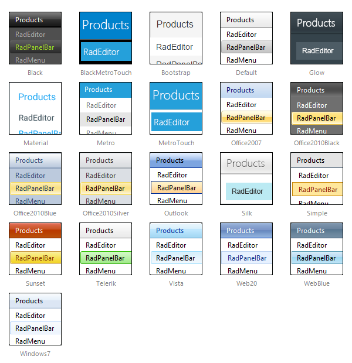

# Skins

**RadPanelBar** uses **skins** to control the overall look-and-feel of the panel bar. A skin is a set of images and a CSS stylesheet that can be applied to the panel bar elements (items, images, etc.) and defines their look and feel. To apply a skin to the panel bar, set its **Skin** property, either using the properties pane or the **RadPanelBar** [Smart Tag]().

**RadPanelBar** is installed with a number of preset skins: 

 @[template - Material skin is available only in Lightweight mode](/_templates/common/skins-notes.md#material-only-in-lightweight) 

## Using No Skin

To use the panel bar with no skin, set the **Skin** property to an empty string and set the **EnableEmbeddedSkins** property to **False**. When using no skin, you will probably want to use your own [CSS classes]() to adjust the appearance of the panel bar.

## Customizing Skins

You can tweak the existing skins, or create your own. Each skin has two main elements: images and a stylesheet. When creating your own, it is a good idea to start with the stylesheet for an existing skin and alter that. See [Tutorial: Creating a Custom Skin]() for a step-by-step walk through. To use your own skin

1. Add the new CSS file to your project.

1. Drag and drop the CSS file from the Project Explorer onto your Web page.

1. Set the **EnableEmbeddedSkins** property of the **RadPanelBar** to **False**.

The stylesheet for a **RadPanelBar** skin has the name **PanelBar.[SkinName].css** and can be found in the **...Skins/[SkinName]** directory. The images are found in the **...Skins/[SkinName]/PanelBar** directory. For example, the stylesheet for the "Black" skin is called PanelBar.Black.css and is located in the ...Skins/Black directory. The images are found in the ...Skins/Black/PanelBar directory. The images are referenced by name from within the stylesheet.

For more information on the CSS File structure, see [Understanding the Skin CSS File]().

# See Also

 * [Setting  the CSS Class of Items]()

 * [Adding Images to Items]()

 * [Templates Overview]()

 * [Telerik ThemeBuilder for ASP.NET AJAX](https://themebuilder.telerik.com/)

