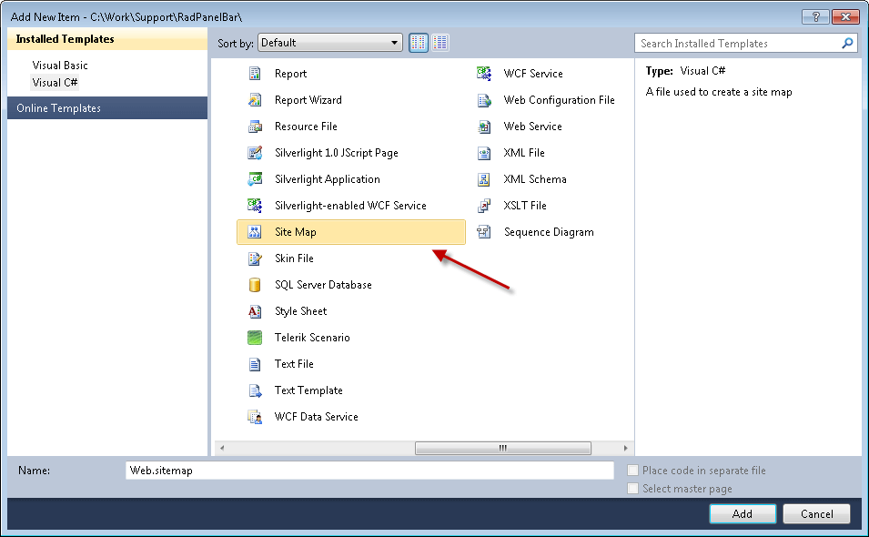
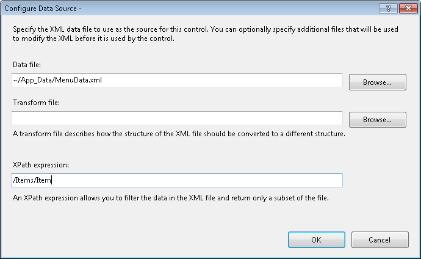
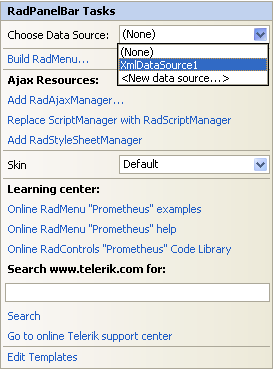
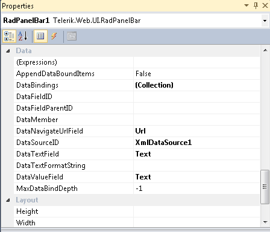

# Binding to Hierarchical DataSource


Some data sources are inherently hierarchical. These include __SiteMapDataSource__ and __XmlDataSource__. When data-bound to these types of data sources, __RadPanelBar__ automatically creates the panel item hierarchy. There is no need to use the __DataFieldID__ and __DataFieldParentID__ properties.

## Binding to SiteMapDataSource

When binding to __SiteMapDataSource__, there is no need to set any properties to map fields from the data source to properties of the panel items. This is because site maps have a strictly defined structure.

The __SiteMapDataSource__ control defines the structure of your Web site. You can have only one sitemap per site. By default the __SiteMapDataSource__ control uses the default Site Navigation Provider. This provider lets you define the structure of your site, separating the real page structure of the site on one hand, and the UI presentation on the other.

The default site navigation provider is XML-based. It should stay in the root level of your project and should be named __web.sitemap__. Using the Site Navigation API provided in ASP.NET v2.0, you can write your own Site Navigation Provider and expose the navigation information from any back-end system, if needed.

## Setting the SiteMapDataSource control

Before adding the __SiteMapDataSource__ control to your page, you need to add the Site Navigation Provider.

1. In the Solution Explorer, choose __Add New Item__... In the templates dialog, select __Site Map__:

1. Click the Add button. Visual Studio generates the web.sitemap file with the initial code:

````XML
	    
	    <?xml version="1.0" encoding="utf-8" ?>
	    <siteMap xmlns="http://schemas.microsoft.com/AspNet/SiteMap-File-1.0" >
	      <siteMapNode url="" title=""  description="">
	          <siteMapNode url="" title=""  description="" />
	          <siteMapNode url="" title=""  description="" />
	      </siteMapNode>
	    </siteMap> 
````


1. Populate the Web.sitemap file. Here is an example:

````XML
	    <?xml version="1.0" encoding= "utf-8" ?>
	    <siteMap xmlns="http://schemas.microsoft.com/AspNet/SiteMap-File-1.0" >
	    <siteMapNode url="http://www.telerik.com" title="Telerik" description="Telerik home page">
	    <siteMapNode url="http://www.telerik.com/radcontrols" title="Telerik RadControls for ASP.NET" description ="Telerik RadControls for ASP.NET" >
	    <siteMapNode url="http://www.telerik.com/radeditor" title="Telerik RadEditor" description="Telerik RadEditor control"/>
	    </siteMapNode>
	    <siteMapNode url="http://www.telerik.com/radnavigation" title="Telerik RadNavigation controls" description ="Telerik RadNavigation controls" />
	    </siteMapNode>
	    </siteMap>  
````


>caution The url must be unique for each node. Avoid using backslashes ('\') for your URLs. Backslashes may cause problems with some browsers. Instead, we use the slash character ('/').
>


1. Drag a __SiteMapDataSource__ instance from the Toolbox to your Web page.

1. Set the __ShowStartingNode__ property of the __SiteMapDataSource__ component to __False__. This allows you to use multiple panel items at the root level.

## Binding the SiteMapDataSource to Telerik RadPanelBar

1. From the __RadPanelBar__ property pane, set the __DataSourceID__ to the __ID__ of the __SiteMapDataSource__ control.

1. Each __siteMapNode__ has three attributes which are mapped automatically to the respective properties:

* __url__ - Maps to the __NavigateUrl__ property. The path can be either relative (using the ~/), or absolute.

* __title__ - Maps to the __Text__ property.

* __description__ - Maps to the __ToolTip__ property.

1. To set additional properties or overwrite already populated fields, use the __ItemDataBound__ event. The example below overwrites the __TooTip__ property with the Text value of the item and sets the __Value__ property to a concatenated string of [Text] + "_Value". 

>tabbedCode

````C#
	     
	protected void RadPanelBar1_ItemDataBound( object sender, Telerik.Web.UI.RadPanelBarEventArgs e)
	{ 
	    e.Item.ToolTip = (string )DataBinder.Eval(e.Item.DataItem, "title"); 
	    e.Item.Value = (string)DataBinder.Eval(e.Item.DataItem, "title") + "_Value";
	}
				
````
````VB.NET
	
	    Protected Sub RadPanelBar1_ItemDataBound(ByVal sender As Object, ByVal e As Telerik.Web.UI.RadPanelBarEventArgs)
	        e.Item.ToolTip = CStr(DataBinder.Eval(e.Item.DataItem, "title"))
	        e.Item.Value = CStr(DataBinder.Eval(e.Item.DataItem, "title")) + "_Value"
	    End Sub
	
````
>end

## Binding to XmlDataSource

When binding to an __XmlDataSource__, __RadPanelBar__ creates the panel item hierarchy automatically. However, unlike __SiteMapDataSource__, properties such as __Text__ and __NavigateUrl__ are __not__ automatically populated.

Consider the following example:

1. Add the following xml file in the App_Data folder:

````XML
	    <?xml version="1.0" encoding= "utf-8" ?>
	    <Items Text="">
	    <Item Text="European cities" Url="" >
	      <Item Text="Sofia" Url="http://en.wikipedia.org/wiki/Sofia" />
	      <Item Text="Berlin" Url="http://en.wikipedia.org/wiki/Berlin" />
	      <Item Text="Paris" Url="http://en.wikipedia.org/wiki/Paris" />
	    </Item>
	    <Item Text="North American cities" Url="">
	      <Item Text="Boston" Url="http://en.wikipedia.org/wiki/Boston" />
	      <Item Text="San Francisco" Url="http://en.wikipedia.org/wiki/San_Francisco" />
	      <Item Text="Seattle" Url="http://en.wikipedia.org/wiki/Seattle" />
	      <Item Text="Toronto" Url="http://en.wikipedia.org/wiki/Toronto" />
	    </Item>
	    <Item Text="South American cities" Url="">
	      <Item Text="Rio de Janeiro" Url="http://en.wikipedia.org/wiki/Rio_De_Janeiro" />
	      <Item Text="Buenos Aires" Url="http://en.wikipedia.org/wiki/Buenos_aires" />
	    </Item>
	    <Item Text="Asian cities" Url="">
	      <Item Text="Tokyo" Url="http://en.wikipedia.org/wiki/Tokyo" />
	      <Item Text="Seul" Url="http://en.wikipedia.org/wiki/Seul" />
	      <Item Text="Beijing" Url="http://en.wikipedia.org/wiki/Beijing" />
	      <Item Text="Tehran" Url="http://en.wikipedia.org/wiki/Teheran" />
	    </Item>
	    <Item Text="African cities" Url="">
	      <Item Text="Kano" Url="http://en.wikipedia.org/wiki/Kano" />
	      <Item Text="Johannesburg" Url="http://en.wikipedia.org/wiki/Johannesburg" />
	      <Item Text="BeninCity" Url="http://en.wikipedia.org/wiki/Benin" />
	    </Item>
	    </Items> 
	    </html>
````


1. Drag an instance of __XmlDataSource__ onto your Web form and configure the control:

1. Set the Data file to the XML file you just added.

1. Set the XPath expression to "/Items/Item". This removes the starting node of the XML file so that you can have multiple root-level panel items.

1. Set the __DataSourceID__ of your RadPanelBar to the ID of the XmlDataSource or choose the XMLDataSource from the smart tag:

1. Map the __Text__, __Value__ and __NavigateUrl__ fields by setting the __DataTextField__, __DataValueField__ and __DataNavigateUrlField__ properties:

>note This example has no separate field for value, so it uses the Text field for the __Value__ property, for illustrative purposes.
>


1. As with the SiteMapDataSource example above, you can map additional properties using the [ItemDataBound event](): 

>tabbedCode

````C#
	     
	protected void RadPanelBar1_ItemDataBound( object sender, Telerik.Web.UI.RadPanelBarEventArgs e)
	{  
	    if (e.Item.Level > 0)
	        //set tooltip only for child items   
	    {                 
	        XmlElement element = (XmlElement)e.Item.DataItem;     
	        e.Item.ToolTip = "Read more about " + element.Attributes["Text"].Value;   
	    }
	}
				
````
````VB.NET
	
	    Protected Sub RadPanelBar1_ItemDataBound(ByVal sender As Object, ByVal e As Telerik.Web.UI.RadPanelBarEventArgs) Handles RadPanelBar1.ItemDataBound
	
	        If e.Item.Level > 0 Then
	
	            'set tooltip only for child items       
	            Dim element As XmlElement = DirectCast(e.Item.DataItem, XmlElement)
	            e.Item.ToolTip = "Read more about " + element.Attributes("Text").Value
	        End If
	    End Sub
	
````
>end

# See Also

 * [Overview]()

 * [Using DataBindings]()

 * [Binding to Table-Based DataSource]()

 * [Binding to DataTable]()

 * [Binding to Object-Based DataSources]()
