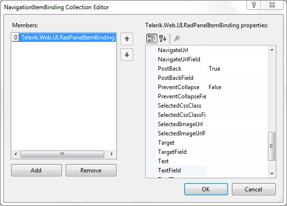

# NavigationItemBinding Collection Editor

## 

The __NavigationItemBinding Collection Builder__ lets specify how to map the fields from a declarative data source to the properties of the items in your panel bar. To use the __NavigationItemBinding Collection Builder__, you must first set the __DataSourceID__ property. Once the panel bar is bound to a data source, There are three ways to display the NavigationItemBinding Collection Builder:

* Right-click on the __RadPanelBar__ control and choose __Edit RadPanelBar Databindings__ from the context menu.

* From the __RadPanelBar__[Smart Tag](), choose __Edit RadPanelBar Databindings...__

* From the __RadPanelBar__ properties pane, click the ellipsis button next to the __DataBindings__ property.

Each item in the collection represents a set of data bindings between the data source and the items at a given level of the panel bar (root items, items at the first child level, and so on). You can also create an item that gives the default mapping to cover any levels not specificly mapped by another item.

To add items to the collection, click the __Add__ button, and set the item properties in the right hand pane of the dialog.

To delete items from the collection, select the item and click the __Remove__ button.

The properties of each item in the collection specify how the __RadPanelBarItem__ properties should be assigned:

* Typically, for each __RadPanelBarItem__ property, there are two properties for the data binding: one is a hard-coded property value that is assigned to all panel items to which the data binding applies, the other is the name of a field from the data source from which the property value can be taken. Thus, for example, the __Text__ property and the __TextField__ property both set the __Text__ of a panel item, but the __Text__ property sets the __RadPanelItem__ text to a hard-coded string, while the __TextField__ property maps it to a field from the data source.

* The __Depth__ property indicates the level of panel items to which the data binding applies. If __Depth__ is not set, the data binding applies to all panel items not mapped by another binding. The collection should contain only one item with no value assigned to the __Depth__ property.

* The __FormatString__ property specifies how to format the text supplied by the __TextField__ of the data source.

* The __DataMember__ property specifies the table from which to map items. This property lets you use different tables from the same __DataSet__ to supply values at different levels of the panel bar.

# See Also

 * [Using DataBindings]()
