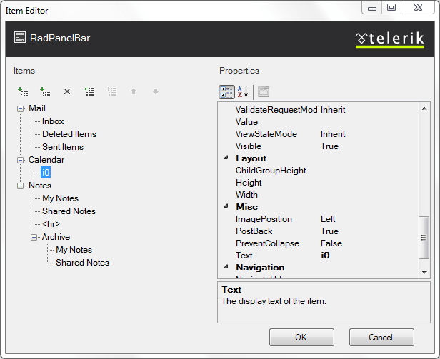
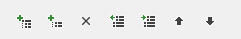
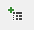
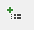
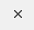
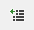
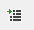
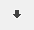

# RadPanelBar Item Builder

The **RadPanelBar Item Editor** lets you populate your panel bar with a hierarchy of items that do not come from a separate data source. There are three ways to bring up the RadPanelBar Item Editor:

* From the **RadPanelBar**[ Smart Tag ](), click on the **Build RadPanelBar** link.

* Right-click on the **RadPanelBar** component and select **Build RadPanelBar** from its context menu.

* In the Properties pane, with **RadPanelBar** selected, click on the ellipsis button next to the **Items** property.

## RadPanelBar Item Editor

The **RadPanelBar Item Editor** lets you add, rearrange, configure, and delete panel items. These actions are initiated using the tool bar at the upper left of the Item editor:

The following table describes the controls in the tool bar:

>caption  

|  **Button**  |  **Function**  |
| ------ | ------ |
||Adds a root item to the panel bar in the next available position. Root items are the top-level items (panel items with no parent item).|
||Adds a child item to the currently selected panel item. The child can belong to either a root item or another child item.|
||Deletes the currently selected panel item. When you delete a panel item, its child items are deleted as well.|
||Moves the currently selected panel item up a level, making it a sibling to its parent item (following the parent item).|
||Moves the currently selected panel item down a level, making it the child of its previous sibling.|
||Moves the currently selected panel item backward in its current list of siblings, so that it precedes the previous sibling.|
||Moves the currently selected panel item forward in its current list of siblings, so that it follows the next sibling.|

When a panel item (either a root item or a child item) is selected, the properties pane on the right of the **RadPanelBar Item Editor** lets you configure the item by setting its properties. For each item,

* **Text** is the text of the item as it appears in the panel bar.

* **ToolTip** is the text of a tooltip that appears when the user hovers the mouse over the item.

* **Enabled** controls whether the item is initially enabled or disabled.

* **IsSeparator** specifies whether the panel item [acts as a separator]().

* **Expanded** specifies whether the item is initially expanded.

* **PreventCollapse** specifies whether the user can collapse the item once it is expanded.

* **Selected** specifies whether the item is initially selected.

* **Value** lets you associate a text value with the panel item that you can use when programming the panel bar behavior.

* **NavigateUrl** and **Target** cause the panel item to automatically launch another Web page (specified by **NavigateUrl**) in the window specified by **Target**. If the **Target** property is not set, the new Web page uses the current browser window.

* **PostBack** specifies whether the item causes a postback.

* **CssClass**, **ClickedCssClass**, **DisabledCssClass**, **ExpandedCssClas**, and **FocusedCssClass** [control the appearance of the panel item]() when it is in its normal state, clicked, disabled, expanded, and holds input focus, respectively.

* **ImageUrl**, **SelectedImageUrl**, **DisabledImageUrl**, **ExpandedImageUrl**, and **HoveredImageUrl** let you [specify an image]() that appears on the left of the panel item when it is in its normal state, clicked, disabled, expanded, and when the mouse hovers over it, respectively.

* **ImagePosition** specifies the position of the image in the panel item.

# See Also

 * [Items Overview]()
