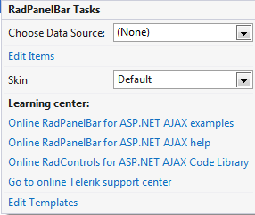
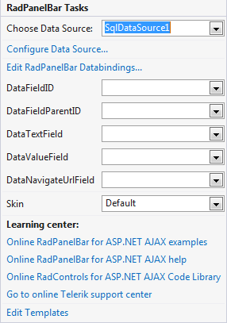

# Smart Tag

The __RadPanelBar__ Smart Tag allows easy access to frequently needed tasks. You can display the Smart Tag by right clicking on a __RadPanelBar__ control in the design window, and choosing __Show Smart Tag__.

## Unbound Smart Tag

When __RadPanelBar__ is unbound, the Smart Tag looks like the following:

Using the unbound __RadPanelBar__ Smart Tag you can perform the following:

## RadPanelBar Tasks

* __Choose Data Source__ lets you bind the menu declaratively by selecting a data source from a drop-down list of all available data source components. If you select __<New Data Source...>__ the standard [Windows Data Source Configuration Wizard](http://msdn2.microsoft.com/en-us/library/w4dd7z6t(VS.80).aspx) appears, where you can create and configure a data source component.

* __Build RadPanelBar...__ opens the [RadPanelBar Item Builder](), where you can create and configure statically-defined items for your menu.

## Ajax Resources

* __Add RadAjaxManager...__ adds a RadAjaxManager component to your Web page, and displays the __r.a.d.ajax Property Builder__ where you can configure it.

* __Replace ScriptManager with RadScriptManager__ replaces the default __ScriptManager__ component that is added for AJAX-enabled Web sites with __RadScriptManager__.

* Add __RadStyleSheetManager__ adds a __RadStyleSheetManager__ to your Web page.

## Skin

The __Skin__ drop-down lets you preview the built-in [skins]() and select one for your menu.

## Learning Center

Links navigate you directly to RadPanelBar examples, help, or code library. You can also search the Telerik web site for a given string.

## Edit Templates

Clicking the __Edit Templates__ link brings up a [template design surface]() where you can create or edit the [templates]() your __RadPanelBar__ uses.

## Bound Smart Tag

When __RadPanelBar__ is bound to a data source, the Smart Tag looks like the following:

Using the bound __RadPanelBar__ Smart Tag you can perform the following:

## RadPanelBar Tasks

* __Choose Data Source__ lets you change the declarative menu binding by selecting a data source from a drop-down list of all available data source components. If you select "__<New Data Source...>__" the standard Windows [Data Source Configuration Wizard](http://msdn2.microsoft.com/en-us/library/ms247282(VS.80).aspx) appears, where you can create and configure a data source component. If you select "__(None)__", you remove the existing binding.

* __Configure Data Source...__ opens the standard Windows [Data Source Configuration Wizard](http://msdn2.microsoft.com/en-us/library/ms247282(VS.80).aspx), where you can configure the currently bound data source component.

* __Refresh Schema__ refreshes the schema for the currently bound data source component.

* __Edit RadPanelBar Databindings__... opens the [NavigationItemBinding Collection Editor](), where you can specify [databindings]() to map between the fields in the data source and __RadPanelItem__ properties.

* Once the Data Source is chosen, you can select each one of the following: __DataFieldID__,__DataFieldParentID__,__DataTextField__,__DataValueField__ and __DataNavigationUrlField__. For the first two, you need to select the fields in the Data Source that will be used when creating the hierarchy of RadPanelBar Items. The rest will serve data respectively for the __Text,____Value__ and __NavigateUrl__ properties of RadPanelBar Items.

* __Edit Templates__ brings up the [template design surface](), where you can create or edit the [templates]() your __RadPanelBar__ uses.
