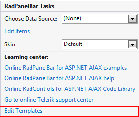
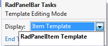
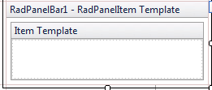

# Template Design Surface

## 

The **Template Design Surface** lets you design templates for the items that appear in the panel bar. There are two ways to display the Template Design Surface:

* Choose **Edit Templates** from the **RadPanelBar**[ Smart Tag ]():

* Choose **Edit Template** from the **RadPanelBar** context menu and select the type of template you want to edit:

Either way, The Template Design Surface appears:

On the design surface, you can drag any HTML elements or controls from the toolbox, as well as typing any literal text.

You can edit templates for all items using the **RadPanelItem Template**. You can also edit templates for individual panel items. Once you have added panel items to your **RadPanelBar** component, select a specific item from the list of item templates in the Smart Tag, or edit them all at once by choosing **Edit Template | Item Templates** from the **RadPanelBar** context menu.

When you have finished designing your template, choose **End Template Editing** from the **RadPanelBar**context menu or Smart Tag.

# See Also

 * [Templates Overview]()

 * [Adding Templates at Designtime]()
