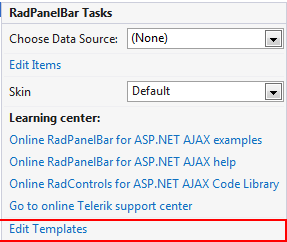
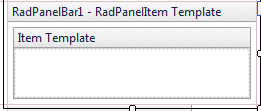

# Template Design Surface

## 

The __Template Design Surface__ lets you design templates for the items that appear in the panel bar. There are two ways to display the Template Design Surface:

* Choose __Edit Templates__ from the __RadPanelBar__[ Smart Tag ]():

* Choose __Edit Template__ from the __RadPanelBar__ context menu and select the type of template you want to edit:

Either way, The Template Design Surface appears:

On the design surface, you can drag any HTML elements or controls from the toolbox, as well as typing any literal text.

You can edit templates for all items using the __RadPanelItem Template__. You can also edit templates for individual panel items. Once you have added panel items to your __RadPanelBar__ component, select a specific item from the list of item templates in the Smart Tag, or edit them all at once by choosing __Edit Template | Item Templates__ from the __RadPanelBar__ context menu.

When you have finished designing your template, choose __End Template Editing__ from the __RadPanelBar__context menu or Smart Tag.

# See Also

 * [Overview]()

 * [Adding Templates at Designtime]()
