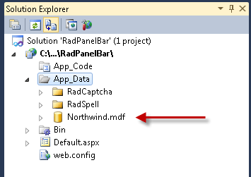
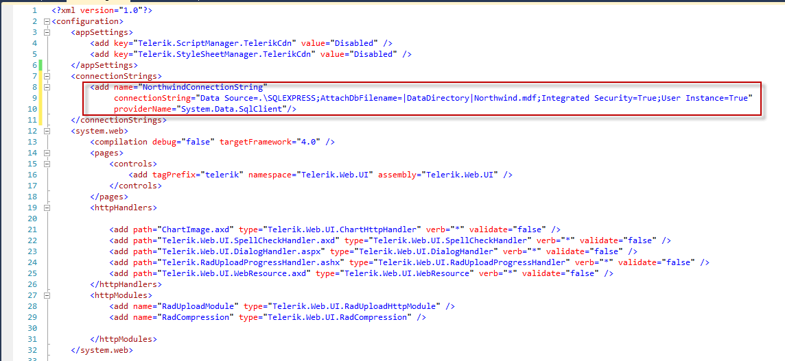
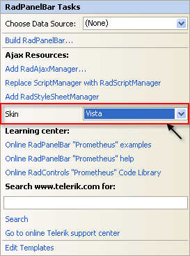
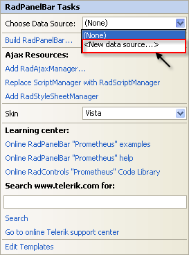
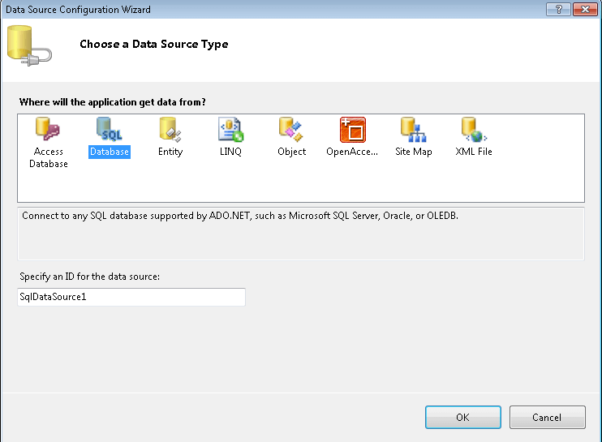
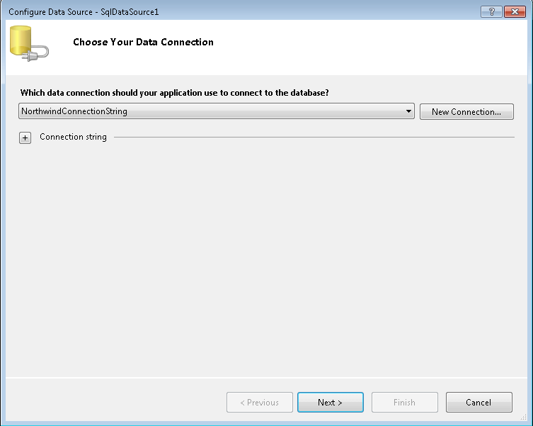
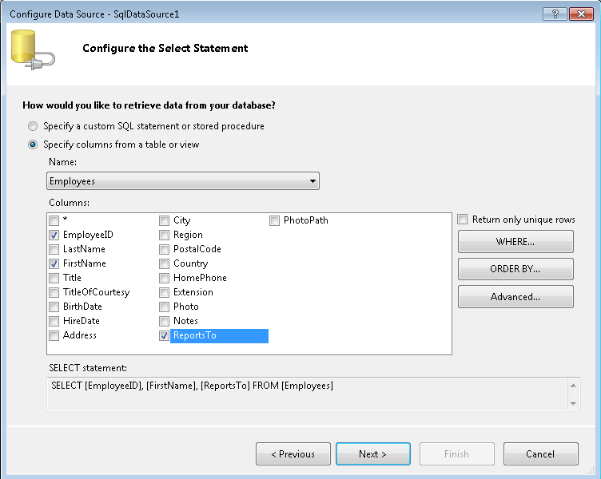
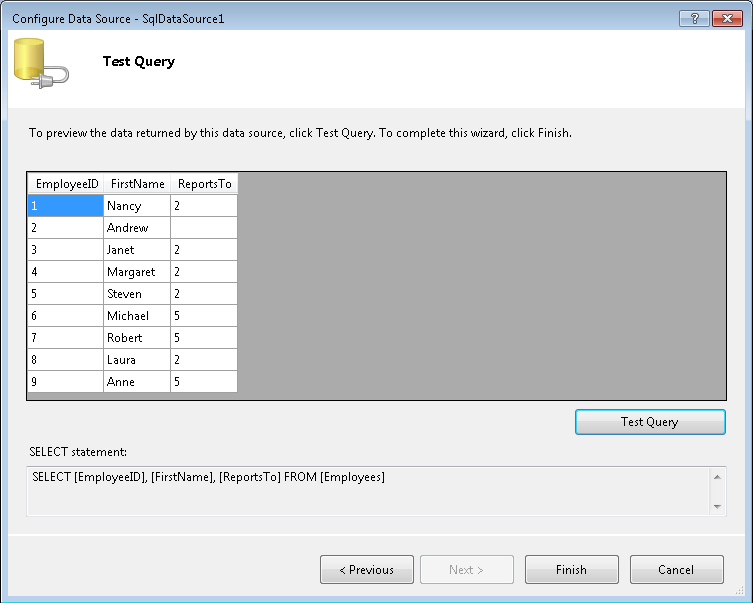
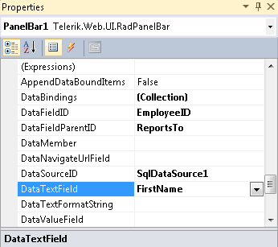
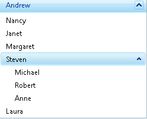

# Binding to a Data Source

## 

This tutorial will show how to bind **RadPanelBar** to an **AccessDataSource**:

1. Locate the "Nwind.mdb" file that appears in the "Live Demos\App_Data" sub-folder of the folder where you installed RadControls "for ASP.NET Ajax".

1. Drag this file ("Northwind.mdf") to the "App_Data" folder in the Solution Explorer for your project:

1. Add the following connection string in the web config file under the connection string section:

1. Drag a **RadPanelBar** component from the toolbox onto your Web page. The **RadPanelBar**[Smart Tag]() should appear automatically:

1. In the **RadPanelBar** Smart Tag, use the **Skin** drop-down to change the [skin]() for the **RadPanelBar** to "Vista":

1. Still in the Smart Tag, open the **Choose Data Source** drop-down and select **New Data Source**.

1. The Data Source Configuration Wizard appears. In the Select a DataSource Type screen, specify an **SqlDataSource** and click **OK.**

1. In the **Choose your Data Connection** screen, click the **Browse** button, and select the "NorthwindConnectionString". Then choose **Next** to continue:

1. In the **Configure the Select Statement** screen, choose **Specify columns from a table or view**.

1. In the **Name** drop-down, select the "Employees" table.

1. In the **Columns** panel, Select the "EmployeeID", "FirstName", and "ReportsTo" fields. Then choose **Next** to continue:

1. Click the **Test Query** button to see the data. Then click **Finish** to exit the Configure Data Source Wizard:

1. In the Properties pane for the **RadPanelBar** component,

* Set the **DataFieldId** property to "EmployeeID".

* Set the **DataFieldParentId** property to "ReportsTo".

* Set the **DataTextField** property to "FirstName":

1. Run the application. The panel bar has a single root level item (for the one record with a null value in the "ReportsTo" field). When you expand this item, you can see level 1 items for every record that had Andrew's ID in the "ReportsTo" field. You can expand the item labelled "Steven" to see the level 2 items for records that had Steven's ID in the "ReportsTo" field:

# See Also

 * [Overview]()

 * [Overview]()
