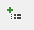
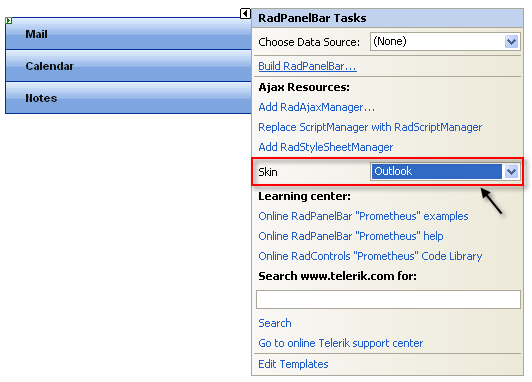

# Getting Started Overview

This tutorial will walk you through creating a **RadPanelBar** and shows how to:

* Use the **RadPanelBar Item Builder** to build a multi-level panel bar.

* Apply a skin to the panel bar to change its look & feel.

* Add a template to a panel bar item.

* Set **RadPanelBar** properties.

## Creating a panel bar using the RadPanelBar Item Builder

* Drag a **RadPanelBar** component from the toolbox onto your Web page. The **RadPanelBar** [ Smart Tag ]() should appear automatically:

* On the Smart Tag, choose **Build RadPanelBar.** The [RadPanelBar Item Builder]() appears:

* Click the **Add root item** button ( ) to add a root item to your panel bar.

* Set its **Text** property to "Mail".

* With the "Mail" item selected, click the **Add child item** button ( ) to add a child to your root item.

	* Select the child item and set its **Text** property to "In Box".

* Select the "Mail" item again, and click the **Add child item** button twice to add two more child items.

	* Set the **Text** property of the first of these to "Deleted Items".

	* Set the **Text** property of the second of these to "Sent Items".

* Click the **Add root item** button to add another root item. Set its **Text** property to "Calendar".

* With the "Calendar" item selected, click the Add child item button to add a child item. Set its **Text** property to an empty string.

* Click the **Add root item** button again to add a third root item. Set its **Text** property to "Notes".

* Select the "Notes" item and click the **Add child item** button four times to add four child items.

	* Set the **Text** property of the first child item to "My Notes".

	* Set the **Text** property of the second child item "Shared Notes".

	* Set the **Text** property of the third child item to `
` and set its **IsSeparator** property to **True**.

	* Set the **Text** property of the fourth child item to "Archive".

* Select the "Archive" child item. With the Archive button selected, click the **Add child item** button twice to give the child item two child items of its own.

	* Set the **Text** property of the first child item to "My Notes"

	* Set the **Text** property of the second child item to "Shared Notes".

* Click **OK** to confirm and exit.

* Back in the **RadPanelBar** Smart Tag, use the **Skin** drop-down to change the [skin]() for the **RadPanelBar** to "Outlook". The appearance of the **RadPanelBar** in the designer changes to reflect the new skin:

* In the **RadPanelBar** Smart Tag, click the **Edit Templates** link.

* The Smart Tag switches to template editing mode. From the **Display** drop-down, select the template for the child item of the "Calendar" item:

* Drag a **RadCalendar** control from the toolbox onto the [Template Design Surface](). Set its **Skin** property to "Outlook" to match the panel bar:

* Click on the **RadPanelBar** Smart Tag anchor to display its Smart Tag again, and choose **End Template Editing**:

* Right click on the **RadPanelBar**, and from its context menu, choose **Properties**.

* In the **Behavior** section of the properties pane:

	* Expand the **ExpandAnimation** property and set the **Type** to "InOutBounce". This introduces an [animated effect]() when items are expanded.

	* Set the **ExpandMode** property to "SingleExpandedItem". This specifies that only one item can be [expanded]() at a time.

* Run the application. Click on the panel bar items to expand them. Note the animated effect. When you expand the "Calendar" item, the template displays:When you click the Notes item, the second level of items appears. You can then click on the "Archive" item to display the third level of items:

# See Also

 * [Binding to a Data Source]()
