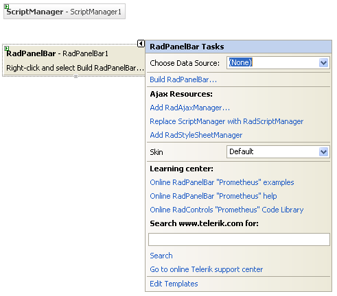
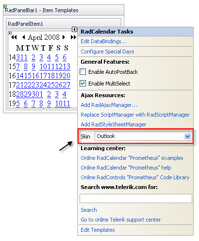

# Getting Started Overview

This tutorial will walk you through creating a __RadPanelBar__ and shows how to:

* Use the __RadPanelBar Item Builder__ to build a multi-level panel bar.

* Apply a skin to the panel bar to change its look & feel.

* Add a template to a panel bar item.

* Set __RadPanelBar__ properties.

## Creating a panel bar using the RadPanelBar Item Builder

1. Drag a __RadPanelBar__ component from the toolbox onto your Web page. The __RadPanelBar__[ Smart Tag ]() should appear automatically:

1. On the Smart Tag, choose __Build RadPanelBar.__ The [RadPanelBar Item Builder]() appears:

1. Click the __Add root item__ button ( ) to add a root item to your panel bar.

* Set its __Text__ property to "Mail".

1. With the "Mail" item selected, click the __Add child item__ button ( ) to add a child to your root item.

* Select the child item and set its __Text__ property to "In Box".

1. Select the "Mail" item again, and click the __Add child item__ button twice to add two more child items.

* Set the __Text__ property of the first of these to "Deleted Items".

* Set the __Text__ property of the second of these to "Sent Items".

1. Click the __Add root item__ button to add another root item. Set its __Text__ property to "Calendar".

1. With the "Calendar" item selected, click the Add child item button to add a child item. Set its __Text__ property to an empty string.

1. Click the __Add root item__ button again to add a third root item. Set its __Text__ property to "Notes".

1. Select the "Notes" item and click the __Add child item__ button four times to add four child items.

* Set the __Text__ property of the first child item to "My Notes".

* Set the __Text__ property of the second child item "Shared Notes".

* Set the __Text__ property of the third child item to "
" and set its __IsSeparator__ property to __True__.

* Set the __Text__ property of the fourth child item to "Archive".

1. Select the "Archive" child item. With the Archive button selected, click the __Add child item__ button twice to give the child item two child items of its own.

* Set the __Text__ property of the first child item to "My Notes"

* Set the __Text__ property of the second child item to "Shared Notes".

1. Click __OK__ to confirm and exit.

1. Back in the __RadPanelBar__ Smart Tag, use the __Skin__ drop-down to change the [skin]() for the __RadPanelBar__ to "Outlook". The appearance of the __RadPanelBar__ in the designer changes to reflect the new skin:

1. In the __RadPanelBar__ Smart Tag, click the __Edit Templates__ link.

1. The Smart Tag switches to template editing mode. From the __Display__ drop-down, select the template for the child item of the "Calendar" item:

1. Drag a __RadCalendar__ control from the toolbox onto the [Template Design Surface](). Set its __Skin__ property to "Outlook" to match the panel bar:

1. Click on the __RadPanelBar__ Smart Tag anchor to display its Smart Tag again, and choose __End Template Editing__:

1. Right click on the __RadPanelBar__, and from its context menu, choose __Properties__.

1. In the __Behavior__ section of the properties pane,

* Expand the __ExpandAnimation__ property and set the __Type__ to "InOutBounce". This introduces an [animated effect]() when items are expanded.

* Set the __ExpandMode__ property to "SingleExpandedItem". This specifies that only one item can be [expanded]() at a time.

1. Run the application. Click on the panel bar items to expand them. Note the animated effect. When you expand the "Calendar" item, the template displays:When you click the Notes item, the second level of items appears. You can then click on the "Archive" item to display the third level of items:

# See Also

 * [Binding to a Data Source]()
