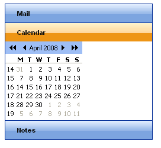

# Overview Overview

## 

**Telerik RadPanelBar for ASP.NET Ajax** is a flexible navigation component for use in ASP.NET applications. The panel bar can act as a vertical menu, or, by using templates, it can act as an entry form or tool bar.

**RadPanelBar** introduces powerful features, including

* A [client-side API]() that includes the ability to add, remove and update panel items and have these changes persist after a postback to the server.

* Numerous options in how to populate the panel bar, including

	* [Defining items statically at design time]().

	* [Creating items dynamically in server-side code]().

	* [Creating items dynamically in client-side code]().

	* [Loading Items from an XML file or string]().

	* [Binding to a data source.]()

* Extensive [keyboard support](), covering both web (access keys and tab) and windows (arrows).

* Many options for [controlling appearance](), including

	* The ability to [add images to items]()

	* [Animations]() to customize the way child items appear and disappear.

	* Built-in [skins]() to quickly change the look and feel.

	* [Style sheet support for individual items]().

	* The ability to create your own [custom skins]().

	* Support for [right-to-left locales]().

	* Support for [templates]().

* [Custom attributes]() to extend the capabilities of the panel items.

* Lightweight markup (no tables).

* [Compliance to multiple standards]().

* [Cross-page postbacks](), which let you direct postbacks from the panel bar to a different Web page.

* Support for [ASP.NET validation]().

* Support for all major browsers, including Internet Explorer 5.0 and above, Netscape 6.0 and above, Mozilla 1.0 and above,Firefox 0.8 and above, Opera 7.5 and above, and Safari 2.0.4 and above.

