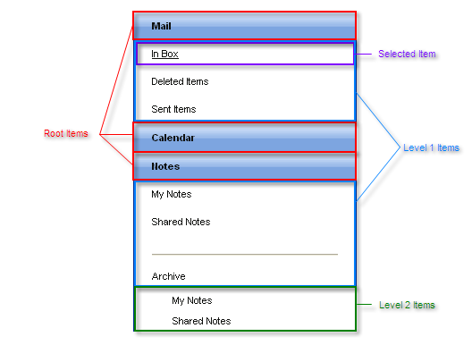

# Structure


## 

The structure of the __RadPanelBar__control is as follows:



The panel bar consists of a hierarchy of items. The items on one level are exposed when the parent item on the previous level is expanded. Each item is represented by a __RadPanelItem__ instance.

* At the top level are the __root items__. These items are always visible. They are available using the __Items__ property of the panel bar (__RadPanelBar.Items__).

* Each root item may have, nested within it, a set of child items. Children of the root items are considered __level 1 items__. They are available using the __Items__ property of the root item (__RadPanelItem.Items__)

* Child items may have, nested within them, their own sets of child items. Children of level 1 items are considered __level 2 items__; children of level 2 items are considered __level 3 items__; and so on.

One item in the panel bar can be designated as the Selected item. This is the last item that the user clicks, and has a distinct appearance from the other items at its level.

If the items are created at design time, the hierarchy is reflected in the ASP.NET declaration of the panel bar:

````ASPNET
	    <telerik:radpanelbar id="RadPanelBar1" runat="server" skin="Outlook">  
	    <Items>    
	        <telerik:RadPanelItem runat="server" Text="Mail">      
	        <Items>       
	             <telerik:RadPanelItem runat="server" Text="In Box" />        
	             <telerik:RadPanelItem runat="server" Text="Deleted Items" />        
	             <telerik:RadPanelItem runat="server" Text="Sent Items" />      
	         </Items>   
	         </telerik:RadPanelItem>   
	         <telerik:RadPanelItem runat="server" Text="Calendar">      
	             <Items>        
	             <telerik:RadPanelItem runat="server">          
	             <ItemTemplate>            
	                <telerik:RadCalendar ID="RadCalendar1" runat="server" Skin="Outlook" />          
	             </ItemTemplate>        
	             </telerik:RadPanelItem>      
	         </Items>   
	         </telerik:RadPanelItem>  
	          <telerik:RadPanelItem runat="server" Text="Notes">      
	          <Items>         
	              <telerik:RadPanelItem runat="server" Text="My Notes" />         
	              <telerik:RadPanelItem runat="server" Text="Shared Notes" />         
	              <telerik:RadPanelItem runat="server" IsSeparator="True" Text="&lt;hr&gt;" />         
	              <telerik:RadPanelItem runat="server" Text="Archive">           
	               <Items>               
	                   <telerik:RadPanelItem runat="server" Text="My Notes" />               
	                   <telerik:RadPanelItem runat="server" Text="Shared Notes" />            
	               </Items>         
	               </telerik:RadPanelItem>       
	           </Items>    
	           </telerik:RadPanelItem>  
	       </Items>
	       </telerik:radpanelbar>
````


# See Also

 * [Declaring Items Statically at Designtime]()

 * [Overview]()
