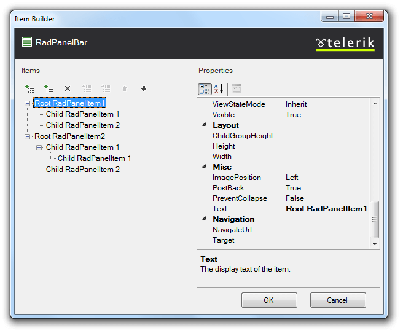
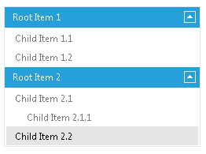

# Declaring Items Statically at Designtime


## 

It is easy to define the hierarchy of panel items statically at design time. You can use the [RadPanelBar Item Builder]() to create the hierarchy in the Visual Studio Designer:



Alternately, you can use the Source page to specify the items declaratively:

````ASPNET
	    <telerik:RadPanelBar
	        ID="RadPanelBar1" runat="server"
	        Skin="Metro">
	        <Items >
	            <telerik:RadPanelItem Text="Root Item 1" runat="server">
	                <Items>
	                    <telerik:RadPanelItem Text="Child Item 1.1" runat="server">
	                    </telerik:RadPanelItem>
	                    <telerik:RadPanelItem Text="Child Item 1.2" runat="server">
	                    </telerik:RadPanelItem>
	                </Items>
	            </telerik:RadPanelItem>
	            <telerik:RadPanelItem runat="server" Text="Root Item 2">
	                <Items>
	                    <telerik:RadPanelItem runat="server" Text="Child Item 2.1">
	                        <Items>
	                            <telerik:RadPanelItem runat="server" Text="Child Item 2.1.1">
	                            </telerik:RadPanelItem>
	                        </Items>
	                    </telerik:RadPanelItem>
	                    <telerik:RadPanelItem runat="server" Text="Child Item 2.2">
	                    </telerik:RadPanelItem>
	                </Items>
	            </telerik:RadPanelItem>
	        </Items >
	    </telerik:RadPanelBar>
````


The result is a hierarchy of panel items:



# See Also

 * [Custom Attributes]()

 * [Overview]()
