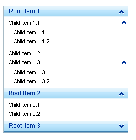
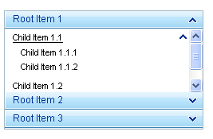

# Expanding and Collapsing Items

The **ExpandMode** property affects the way the panel bar responds when users select panel items that have child items. **ExpandMode** has three possible settings:

* **MultipleExpandedItems** (the default)

* **SingleExpandedItem**

* **FullExpandedItem**

## MultipleExpandedItems

When **ExpandMode** is "MultipleExpandedItems", more than one item can be expanded at a time. The panel bar ignores the value of its **Height** property and resizes as needed to display all expanded items:

## Expanding items

Clicking on an unexpanded item (or pressing [ENTER] when the item has focus) causes it to expand. The other panel items in the panel bar are unaffected.

## Collapsing items

Clicking on an expanded item (or pressing [ESC] when the item has focus) causes it to collapse. To prevent an item from being collapsible, you can set its **PreventCollapse** property to **True**.

## SingleExpandedItem

When **ExpandMode** is "SingleExpandedItem", only one item can be expanded at a time.

>note There is an exception to this rule. If a panel item has its **PreventCollapse** property set to **True** , then the user can expand another item at the same level, and the panel bar will allow both items to be expanded at the same time.
>

The panel bar ignores the value of its **Height** property and resizes as needed to display all expanded items:

## Expanding items

Clicking on an unexpanded item (or pressing [ENTER] when the item has focus) causes it to expand and any other panel item at the same level to collapse.

## Collapsing items

By default, an expanded item can only be collapsed by expanding another item at the same level of the panel bar. (This is true even if another item is expanded because its **PreventCollapse** property has been set to **True**).

To allow users to collapse items by clicking on them when **ExpandMode** is "SingleExpandedItem", set the **AllowCollapseAllItems** property to **True**.

## FullExpandedItem

When **ExpandMode** is "FullExpandedItem", only one item can be expanded at a time (just like "SingleExpandedItem"). However, in this mode, the panel bar always maintains the height specified by its **Height** property.

If the panel items are do not fill the entire height, the region for the Level 1 panel items expands to fill the entire height of the panel bar:

If the panel items do not fit within the height of the panel bar, the panel bar displays scroll bars:

>note We strongly recommend the use of **FullExpandedItem** together with Height property.
>

## Expanding items

## Collapsing items

As with "SingleExpandedItem", an expanded item can only be collapsed by expanding another item at the same level of the panel bar unless the **AllowCollapseAllItems** property is **True**. When AllowCollapseAllItems is True, users can collapse expanded items by clicking on them (or pressing [ENTER] when they have focus).
