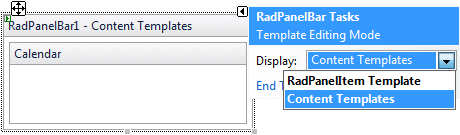
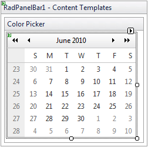
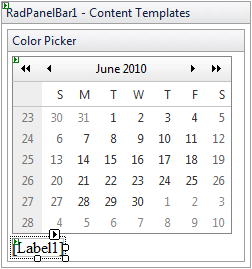
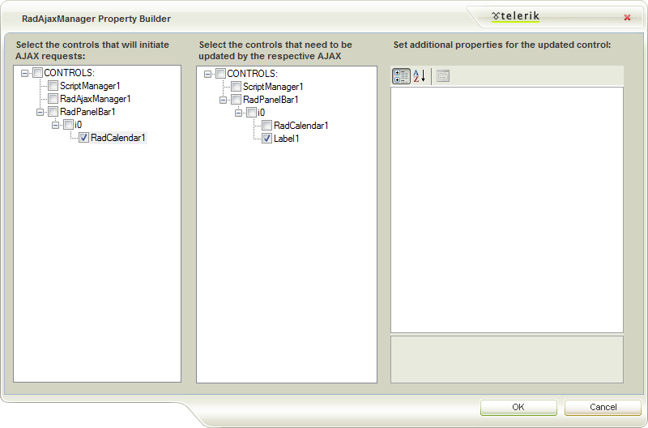
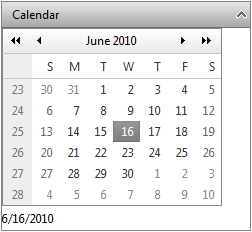
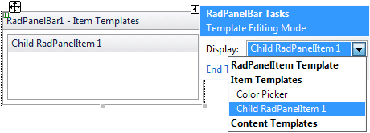
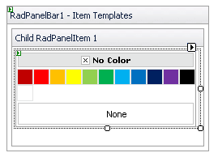
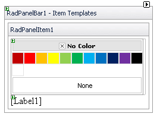
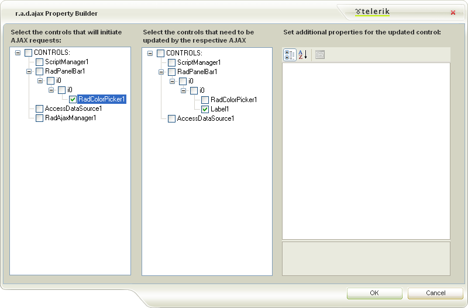
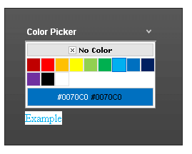

# Adding Templates at Designtime


This examples below show how to use the [Template Design Surface]() to add a **RadControl** to an expandable/collapsible PanelItem by using either a **ContentTemplate** or an **ItemTemplate**.

## Content Template

In this example, a RadCalendar control and a Label are added in the **ContentTemplate** of a root PanelItem.

1. Drag a **RadPanelbar** from the toolbox onto your Web page.

1. Create one root item with text "Calendar".

1. From the Smart Tag that appears when you drop the **RadPanelbar**, choose **Edit Templates**.

1. The Template Design Surface appears, set for editing the **ContentTemplate**. The template design surface of the only Item will appear:

1. Drag a **RadCalendar** control from the toolbox onto the Template Design Surface:
	

1. Drag a Label control from the toolbox onto the Template Design surface under the calendar:
	

1. Right click on the **Label** control, choose **Properties** from its context menu, and set the **Text** property to "Select Date".

1. Right click on the **RadCalendar** control, choose **Properties** from its context menu, set the **AutoPostBack** property to **true** and the **EnableMultiSelect** property to **false**.

1. Give the **RadCalendar** control a **SelectionChanged** event handler:


	````C#
		
	protected void RadCalendar_SelectionChanged(object sender, SelectedDatesEventArgs e) 
	{ 
		Label1.Text = RadCalendar1.SelectedDate.ToShortDateString(); 
	}
		
	````
	````VB.NET
		
	Protected Sub RadCalendar_SelectionChanged(ByVal sender As Object, ByVal e As SelectedDatesEventArgs)

		Label1.Text = RadCalendar1.SelectedDate.ToShortDateString()

	End Sub
		
	````


	>note The code in the event handler directly accesses from inside the Content Template both the Calendar and the Label by their IDs. This is a feature of Content Templates.
	>


1. Use the Smart Tag anchor to display the Edit Templates pop-up, and choose **End Template Editing** to close the Template Design Surface.

1. In the Smart Tag for the **RadPanelBar** control, click on **Add RadAjaxManager**.

1. In the **RadAjaxManager Property Builder**, select the calendar as a control that initiates AJAX requests. In the controls that need to be updated, select the label:

1. Run the application. When you click on the root item, the calendar is displayed. When you select a date from the calendar, the "Example" label reflects the selected date:
	

## Item Template

This example shows how to use the [Template Design Surface]() to add a **RadColorPicker** control to an expandable/collapsible PanelItem by using the **ItemTemplate**.

1. Drag a **RadPanelbar** from the toolbox onto your Web page.

1. Create one root item with text "Color Picker" and add a child item to it with no text.

1. From the Smart Tag that appears when you drop the **RadPanelbar**, choose **Edit Templates**.

1. The Template Design Surface appears, set for editing the **ItemTemplate**.

1. Select the child item to display its template designsurface
	

1. Drag a **RadColorPicker** control from the toolbox onto the Template Design Surface:
	

1. Drag a Label control from the toolbox onto the Template Design surface under the color picker:
	

1. Right click on the **Label** control, choose **Properties** from its context menu, and set the **Text** property to "Example".

1. Right click on the **RadColorPicker** control, choose **Properties** from its context menu, and set the **AutoPostBack** property to **true**.

1. Give the **RadColorPicker** control a **ColorChanged** event handler: 

	````C#
		
	protected void RadColorPicker1_ColorChanged(object sender, EventArgs e) 
	{ 
		RadColorPicker picker = sender as RadColorPicker; 
		Label label = picker.Parent.FindControl("Label1") as Label; 
		label.ForeColor = picker.SelectedColor; 
	}
		
	````
	````VB.NET
		
	Protected Sub RadColorPicker1_ColorChanged(ByVal sender As Object, ByVal e As EventArgs) Handles RadColorPicker1.ColorChanged

		Dim picker As RadColorPicker = CType(sender, RadColorPicker)
		Dim label As Label = CType(picker.Parent.FindControl("Label1"), Label)
		label.ForeColor = picker.SelectedColor

	End Sub
		
	````

	The event handler finds the label in the panel item's template and sets its font color to the color that was selected in the color picker.

1. Use the Smart Tag anchor to display the Edit Templates pop-up, and choose **End Template Editing** to close the Template Design Surface.

1. In the Smart Tag for the **RadPanelBar** control, click on **Add RadAjaxManager**.

1. In the **r.a.d.ajax Property Builder**, select the color picker as a control that initiates AJAX requests. In the controls that need to be updated, select the label:

1. Run the application. When you click on the root item, the color picker is displayed. When you select a color from the color picker, the "Example" label reflects the selected color:
	

# See Also

 * [Overview]()
