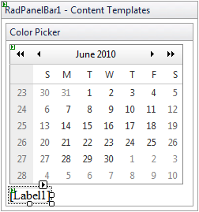
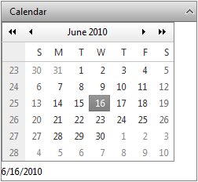
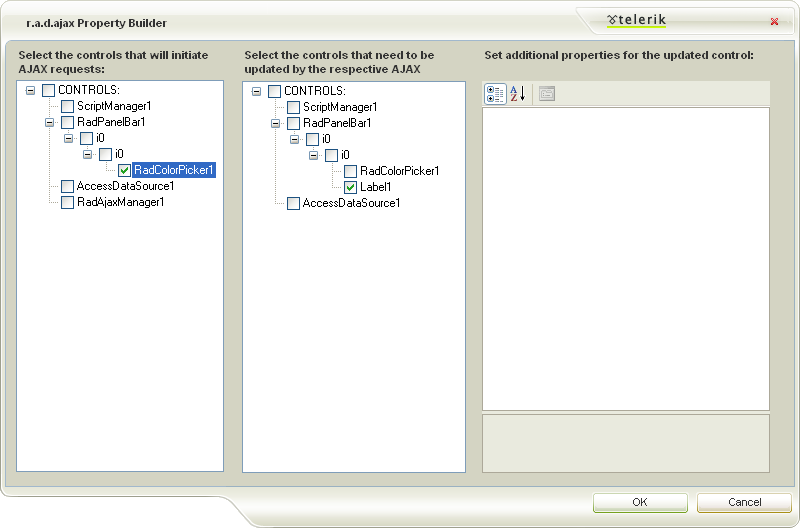

# Adding Templates at Designtime


This examples below show how to use the [Template Design Surface]() to add a __RadControl__ to an expandable/collapsible PanelItem by using either a __ContentTemplate__ or an __ItemTemplate__.

## Content Template

In this example, a RadCalendar control and a Label are added in the __ContentTemplate__ of a root PanelItem.

1. Drag a __RadPanelbar__ from the toolbox onto your Web page.

1. Create one root item with text "Calendar".

1. From the Smart Tag that appears when you drop the __RadPanelbar__, choose __Edit Templates__.

1. The Template Design Surface appears, set for editing the __ContentTemplate__. The template design surface of the only Item will appear:

1. Drag a __RadCalendar__ control from the toolbox onto the Template Design Surface:

1. Drag a Label control from the toolbox onto the Template Design surface under the calendar:

1. Right click on the __Label__ control, choose __Properties__ from its context menu, and set the __Text__ property to "Select Date".

1. Right click on the __RadCalendar__ control, choose __Properties__ from its context menu, set the __AutoPostBack__ property to __true__ and the __EnableMultiSelect__ property to __false__.

1. Give the __RadCalendar__ control a __SelectionChanged__ event handler:


````C#
	
	
	    protected void RadCalendar_SelectionChanged(object sender, SelectedDatesEventArgs e) 
	    { 
	        Label1.Text = RadCalendar1.SelectedDate.ToShortDateString(); 
	    }
	
````
````VB.NET
	
	    Protected Sub RadCalendar_SelectionChanged(ByVal sender As Object, ByVal e As SelectedDatesEventArgs)
	
	        Label1.Text = RadCalendar1.SelectedDate.ToShortDateString()
	
	    End Sub
	
````


>note The code in the event handler directly accesses from inside the Content Template both the Calendar and the Label by their IDs. This is a feature of Content Templates.
>


1. Use the Smart Tag anchor to display the Edit Templates pop-up, and choose __End Template Editing__ to close the Template Design Surface.

1. In the Smart Tag for the __RadPanelBar__ control, click on __Add RadAjaxManager__.

1. In the __RadAjaxManager Property Builder__, select the calendar as a control that initiates AJAX requests. In the controls that need to be updated, select the label:

1. Run the application. When you click on the root item, the calendar is displayed. When you select a date from the calendar, the "Example" label reflects the selected date:

## Item Template

This example shows how to use the [Template Design Surface]() to add a __RadColorPicker__ control to an expandable/collapsible PanelItem by using the __ItemTemplate__.

1. Drag a __RadPanelbar__ from the toolbox onto your Web page.

1. Create one root item with text "Color Picker" and add a child item to it with no text.

1. From the Smart Tag that appears when you drop the __RadPanelbar__, choose __Edit Templates__.

1. The Template Design Surface appears, set for editing the __ItemTemplate__.

1. Select the child item to display its template designsurface

1. Drag a __RadColorPicker__ control from the toolbox onto the Template Design Surface:

1. Drag a Label control from the toolbox onto the Template Design surface under the color picker:

1. Right click on the __Label__ control, choose __Properties__ from its context menu, and set the __Text__ property to "Example".

1. Right click on the __RadColorPicker__ control, choose __Properties__ from its context menu, and set the __AutoPostBack__ property to __true__.

1. Give the __RadColorPicker__ control a __ColorChanged__ event handler: 


````C#
	
	
	    protected void RadColorPicker1_ColorChanged(object sender, EventArgs e) 
	    { 
	        RadColorPicker picker = sender as RadColorPicker; 
	        Label label = picker.Parent.FindControl("Label1") as Label; 
	        label.ForeColor = picker.SelectedColor; 
	    }
	
````
````VB.NET
	
	
	    Protected Sub RadColorPicker1_ColorChanged(ByVal sender As Object, ByVal e As EventArgs) Handles RadColorPicker1.ColorChanged
	
	        Dim picker As RadColorPicker = CType(sender, RadColorPicker)
	        Dim label As Label = CType(picker.Parent.FindControl("Label1"), Label)
	        label.ForeColor = picker.SelectedColor
	
	    End Sub
	
````
 The event handler finds the label in the panel item's template and sets its font color to the color that was selected in the color picker.

1. Use the Smart Tag anchor to display the Edit Templates pop-up, and choose __End Template Editing__ to close the Template Design Surface.

1. In the Smart Tag for the __RadPanelBar__ control, click on __Add RadAjaxManager__.

1. In the __r.a.d.ajax Property Builder__, select the color picker as a control that initiates AJAX requests. In the controls that need to be updated, select the label:

1. Run the application. When you click on the root item, the color picker is displayed. When you select a color from the color picker, the "Example" label reflects the selected color:

# See Also

 * [Overview]()
