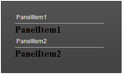
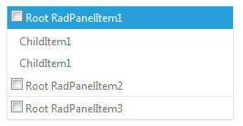

# Adding Templates at Runtime


## 

Templates could be added to __RadPanelBar__ at runtime, using the __ItemTemplate__, __ContentTemplate__ and __HeaderTemplate__ properties. All of them are of type __ITemplate__, so you must assign an object that implements that interface as a value.

>note The RadPanelBar items should be dynamically added so that templates can be defined at run time.
>Also, the __items should be bound__ to be able to eval DataBinder expressions. In other words, you should call the __DataBind__ method of the RadPanelBar object or bind the items that are about to use __DataBinder.Eval__ . You can bind a specific item by calling the __DataBind__ method of this specific item.
>


>tip The __ItemTemplate/ContentTemplate__ should be initialized in the __OnInit__ event of the page. This is needed as the template should be instantiated before the RadPanelBar items are initialized.
>


## Item Template

The example below shows how to add Item Templates at run-time.


````C#
	
	
	    protected override void OnInit(EventArgs e) 
	    {
	        RadPanelBar1.ItemTemplate = new TextBoxTemplate(); base.OnInit(e); 
	    }
	
	    protected void Page_Load(object sender, EventArgs e)
	    {
	        if (!Page.IsPostBack)
	        {
	            RadPanelBar1.Items.Add(new RadPanelItem("PanelItem1")); 
	            RadPanelBar1.Items.Add(new RadPanelItem("PanelItem2"));
	        } 
	
	        RadPanelBar1.DataBind();
	    }
	
	    class TextBoxTemplate : ITemplate 
	    { 
	        public void InstantiateIn(Control container) 
	        { 
	            Label label1 = new Label(); 
	            label1.ID = "ItemLabel"; 
	            label1.Text = "Text";
	            label1.Font.Size = 15;
	            label1.Font.Bold = true; 
	            label1.DataBinding += new EventHandler(label1_DataBinding); 
	            container.Controls.Add(label1); 
	        } 
	        
	        private void label1_DataBinding(object sender, EventArgs e) 
	        { 
	            Label target = (Label)sender; 
	            RadPanelItem item = (RadPanelItem)target.BindingContainer; 
	            string itemText = (string)DataBinder.Eval(item, "Text"); target.Text = itemText; 
	        } 
	    }
	
````
````VB.NET
	
	
	    Protected Overloads Overrides Sub OnInit(ByVal e As EventArgs)
	        RadPanelBar1.ItemTemplate = New TextBoxTemplate()
	        MyBase.OnInit(e)
	    End Sub
	
	    Protected Sub Page_Load(ByVal sender As Object, ByVal e As EventArgs)
	        If Not Page.IsPostBack Then
	            RadPanelBar1.Items.Add(New RadPanelItem("PanelItem1"))
	            RadPanelBar1.Items.Add(New RadPanelItem("PanelItem2"))
	        End If
	        RadPanelBar1.DataBind()
	    End Sub
	Class TextBoxTemplate Implements ITemplate 
	
	        Public Sub InstantiateIn(ByVal container As Control)
	            Dim label1 As New Label()
	            label1.ID = "ItemLabel"
	            label1.Text = "Text"
	            label1.Font.Size = 15
	            label1.Font.Bold = True
	            AddHandler label1.DataBinding, AddressOf label1_DataBinding
	            container.Controls.Add(label1)
	        End Sub
	
	        Private Sub label1_DataBinding(ByVal sender As Object, ByVal e As EventArgs)
	            Dim target As Label = DirectCast(sender, Label)
	            Dim item As RadPanelItem = DirectCast(target.BindingContainer, RadPanelItem)
	            Dim itemText As String = DirectCast(DataBinder.Eval(item, "Text"), String)
	            target.Text = itemText
	        End Sub
	    End Class
	
````


If you for some reason cannot define the template in the __OnInit__ event of the page, you could use another approach:

>note The template has to be instantiated for each item upon a postback. Since the __TextBoxTemplate__ class initializes the label on InstantiateIn we called the InstantiateIn method of the TextBoxTemplate object for each item.
>


````C#
	
	
	    protected void Page_Load(object sender, EventArgs e)
	    {
	        if (!Page.IsPostBack)
	        {
	            RadPanelBar1.Items.Add(new RadPanelItem("PanelItem1")); 
	            RadPanelBar1.Items.Add(new RadPanelItem("PanelItem2"));
	        }
	
	        TextBoxTemplate template = new TextBoxTemplate(); 
	        foreach (RadPanelItem item in RadPanelBar1.GetAllItems()) 
	        { 
	            template.InstantiateIn(item); 
	        } 
	
	        RadPanelBar1.DataBind();
	    }
	
````
````VB.NET
	
	
	    Protected Sub Page_Load(ByVal sender As Object, ByVal e As EventArgs)
	        If Not Page.IsPostBack Then
	            RadPanelBar1.Items.Add(New RadPanelItem("PanelItem1"))
	            RadPanelBar1.Items.Add(New RadPanelItem("PanelItem2"))
	        End If
	        Dim template As New TextBoxTemplate()
	        For Each item As RadPanelItem In RadPanelBar1.GetAllItems()
	            template.InstantiateIn(item)
	        Next
	        RadPanelBar1.DataBind()
	    End Sub
	
````


The end result of this code looks like the following:


>caption 



## Content Template

Here is also an example that uses a Content Template at run-time.

````ASPNET
	  
	    <telerik:RadPanelBar ID="RadPanelBar1" runat="server">
	        <Items>
	            <telerik:RadPanelItem runat="server" Text="Root RadPanelItem1" Value="A">
	            </telerik:RadPanelItem>
	            <telerik:RadPanelItem runat="server" Text="Root RadPanelItem2" Value="B">
	            </telerik:RadPanelItem>
	            <telerik:RadPanelItem runat="server" Text="Root RadPanelItem3" Value="C">
	            </telerik:RadPanelItem>
	        </Items>
	    </telerik:RadPanelBar>
````


````C#
	
	 protected void Page_Load(object sender, EventArgs e)
	    {
	        CustomContentTemplate template = new CustomContentTemplate();
	        foreach (RadPanelItem item in RadPanelBar1.Items)
	        {
	            item.ContentTemplate = new CustomContentTemplate();
	            template.InstantiateIn(item);
	            item.DataBind();
	        }  
	    }  
	 
	
````
````VB.NET
	
	    Protected Sub Page_Load(ByVal sender As Object, ByVal e As EventArgs) Handles Me.Load
	        Dim template As New CustomContentTemplate()
	        For Each item As RadPanelItem In RadPanelBar1.Items
	            item.ContentTemplate = New CustomContentTemplate()
	            template.InstantiateIn(item)
	            item.DataBind()
	        Next
	    End Sub
	
````


Here is the class for the Content Template that is used in the PageLoad


````C#
	
	class CustomContentTemplate : ITemplate
	{
	    public void InstantiateIn(Control container)
	    {
	        Label label1 = new Label();
	        label1.Font.Bold = true;
	        label1.DataBinding += new EventHandler(label1_DataBinding);
	        container.Controls.Add(label1);
	    }
	
	    private void label1_DataBinding(object sender, EventArgs e)
	    {
	        Label target = (Label)sender;
	        RadPanelItem item = (RadPanelItem)target.BindingContainer;
	        target.Text = item.Value;
	        //Alternative way:
	        //string itemText = (string)DataBinder.Eval(item, "Value"); target.Text = itemText;
	    }
	}
	
````
````VB.NET
	
		Class CustomContentTemplate
			Implements ITemplate
			Public Sub InstantiateIn(ByVal container As Control)
				Dim label1 As New Label()
				label1.Font.Bold = True
	            AddHandler label1.DataBinding, AddressOf label1_DataBinding
				container.Controls.Add(label1)
			End Sub
	
			Private Sub label1_DataBinding(ByVal sender As Object, ByVal e As EventArgs)
				Dim target As Label = DirectCast(sender, Label)
				Dim item As RadPanelItem = DirectCast(target.BindingContainer, RadPanelItem)
				target.Text = item.Value
				'Alternative way:
				'string itemText = (string)DataBinder.Eval(item, "Value"); target.Text = itemText;
			End Sub
		End Class
	
````


## Header Template

The dynamic creation of Header Template is a bit different that the one of the Item and Content templates. Once the HeaderTemplate property is set, the __ApplyHeaderTemplate__ method should be invoked in order to apply and instantiate the template.

Here is also an example that uses a Header Template at run-time.

````ASPNET
	  
	    <telerik:RadPanelBar ID="RadPanelBar1" runat="server" Skin="Metro">
	        <Items>
	            <telerik:RadPanelItem runat="server" Text="Root RadPanelItem1" Value="A" Expanded="true">
	                <Items>
	                    <telerik:RadPanelItem Text="ChildItem1" runat="server">
	                    </telerik:RadPanelItem>
	                    <telerik:RadPanelItem Text="ChildItem1" runat="server">
	                    </telerik:RadPanelItem>
	                </Items>
	            </telerik:RadPanelItem>
	            <telerik:RadPanelItem runat="server" Text="Root RadPanelItem2" Value="B">
	            </telerik:RadPanelItem>
	            <telerik:RadPanelItem runat="server" Text="Root RadPanelItem3" Value="C">
	            </telerik:RadPanelItem>
	        </Items>
	    </telerik:RadPanelBar>
````


````C#
	
	    protected void Page_Load(object sender, EventArgs e)
	    {
	        foreach (RadPanelItem item in RadPanelBar1.Items)
	        {
	            item.HeaderTemplate = new HeaderTemplateClass();
	            item.ApplyHeaderTemplate();
	            item.DataBind();
	        }
	    }
	
````
````VB.NET
	
	    Protected Sub Page_Load(sender As Object, e As EventArgs) Handles Me.Load
	        For Each item As RadPanelItem In RadPanelBar1.Items
	            item.HeaderTemplate = New HeaderTemplateClass()
	            item.ApplyHeaderTemplate()
	            item.DataBind()
	        Next
	    End Sub
	
````


Here is the class for the Header Template that is used in the PageLoad


````C#
	
	class HeaderTemplateClass : ITemplate
	{
	    public void InstantiateIn(Control container)
	    {
	        CheckBox HeaderCheckBox = new CheckBox();
	        HeaderCheckBox.DataBinding += new EventHandler(HeaderCheckBox_DataBinding);
	        container.Controls.Add(HeaderCheckBox);
	    }
	    protected void HeaderCheckBox_DataBinding(object sender, EventArgs e)
	    {
	        CheckBox target = (CheckBox)sender;
	        RadPanelItem item = (RadPanelItem)target.BindingContainer.NamingContainer;
	        target.Text = item.Text;
	    }
	}
	
````
````VB.NET
	
	    Class HeaderTemplateClass
	        Implements ITemplate
	        Public Sub InstantiateIn(container As Control) Implements ITemplate.InstantiateIn
	            Dim HeaderCheckBox As New CheckBox()
	            AddHandler HeaderCheckBox.DataBinding, AddressOf HeaderCheckBox_DataBinding
	            container.Controls.Add(HeaderCheckBox)
	        End Sub
	
	        Protected Sub HeaderCheckBox_DataBinding(sender As Object, e As EventArgs)
	            Dim target As CheckBox = DirectCast(sender, CheckBox)
	            Dim item As RadPanelItem = DirectCast(target.BindingContainer.NamingContainer, RadPanelItem)
	            target.Text = item.Text
	        End Sub
	    End Class
	
````


The end result of this code looks like the following:


>caption 



# See Also

 * [PanelBar with Templates demo.](http://demos.telerik.com/aspnet-ajax/panelbar/examples/functionality/templates/defaultcs.aspx)
