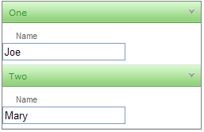

# DataBinding Expressions


## 

Sometimes, when you use Item or Content templates, you want the controls in the template to display information associated with the panel item properties. For example, consider a simple panel bar with a text box in the item templates of child items:

>note Please note that the approach that follows is valid for Content Templates as well.
>


````ASPNET
	    <telerik:radpanelbar id="RadPanelBar1" runat="server" skin="Telerik">  
	    <Items>    
	        <telerik:RadPanelItem runat="server" Text="One">      
	        <Items>        
	            <telerik:RadPanelItem runat="server" Text="Name" Value="Joe">          
	                <ItemTemplate>            
	                    <asp:TextBox ID="TextBox1" runat="server" />          
	                </ItemTemplate>       
	             </telerik:RadPanelItem>       
	             </Items>     
	             </telerik:RadPanelItem>     
	             <telerik:RadPanelItem runat="server" Text="Two">       
	             <Items>         
	             <telerik:RadPanelItem runat="server" Text="Name" Value="Mary">           
	             <ItemTemplate>              
	                <asp:TextBox ID="TextBox2" runat="server" />           
	             </ItemTemplate>         
	             </telerik:RadPanelItem>       
	         </Items>     
	         </telerik:RadPanelItem>  
	     </Items>
	     </telerik:radpanelbar>
````


When you run the application, the panel items all show empty text boxes:


This is good as far as it goes, but perhaps you want to initialize the values of the text boxes. Note that the __Value__ property of the panel items has a name all ready to assign.To override the __Text__ property of the text box in the template, use a __DataBinder.Eval__ statement:

````ASPNET
	    <itemtemplate>    
	         <asp:TextBox ID="TextBox1" runat="server" Text='<%# DataBinder.Eval(Container, "Value") %>'/>
	    </itemtemplate>
````


In the DataBinder.Eval statement, __Container__ is the __RadPanelItem__ and __"Value"__ identifies the __Value__ property of that item.

>note In this example, the first parameter to the DataBinder.Eval statement is __Container__ , because the items are statically bound. If the panel bar was bound to a data source, then you must use __Container.DataItem__ instead. e.g.<%#DataBinder.Eval(Container.DataItem, "TextField") %>
>


In addition to adding a DataBinder.Eval statement, you must also explicitly call the DataBind method for the items so that the template has access to the __Value__ property:

>tabbedCode

````C#
	
	
	    protected void Page_Load(object sender, EventArgs e)
	    {
	        if (!IsPostBack) 
	        { 
	            for (int i = 0; i < RadPanelBar1.Items.Count; i++)      
	            RadPanelBar1.Items[i].DataBind(); 
	        }
	    }
	
````
````VB.NET
	
	
	    Protected Sub Page_Load(ByVal sender As Object, ByVal e As EventArgs) Handles Me.Load
	        If Not IsPostBack Then
	            Dim i As Integer = 0
	            While i < RadPanelBar1.Items.Count
	                RadPanelBar1.Items(i).DataBind()
	                i = i + 1
	            End While
	        End If
	    End Sub
	
````
>end

Now the value of the panel items appears in the text boxes:



# See Also

 * [Overview]()

 * [Overview]()
