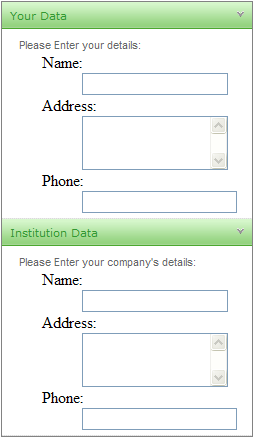

# Templates Overview


**RadPanelBar** items are extremely configurable. In addition to the preset [skins](), you can customize the appearance of panel items by [adding custom images](), using [CSS classes](), or [creating custom skins]().

 If you want to embed HTML or server controls in a panel item, you must use templates. You can embed any content inside a **RadPanelItem** template, including:

* HTML markup
* ASP.NET server controls
* Other third-party controls (including other Telerik controls)

**RadPanelBar** supports three base types of item templates—`ItemTemplate`, `ContentTemplate` and `HeaderTemplate`.

In this article you will find information about:

* [The behavior of the ItemTemplate](#itemtemplate).
* [The behavior of the ContentTemplate](#contenttemplate).
* [The behavior of the HeaderTemplate](#headertemplate).
* [The differences between the ItemTemplate and the ContentTemplate, and when you should use them](#differences-between-contenttemplate-and-itemtemplate).
* [Examples](#examples)
	* [Overriding ItemTemplates for certain items](#overriding-itemtemplates).
	* [Creating complex collapsible hierarchy by combining ItemTemplates and ContentTemplates](#combine-itemtemplate-and-contenttemplate).

>important Read the  [The differences between the ItemTemplate and the ContentTemplate, and when you should use them](#differences-between-contenttemplate-and-itemtemplate) section to get a better understanding on when to use which template. In the most common case, you should use the `ContentTemplate` of a concrete item to add content to it, unless you want it to have child panel items. Using the `ItemTemplate` or the `Controls` collection can result in [various collapsing issues](https://feedback.telerik.com/Project/108/Feedback/Details/217194-collapsing-of-items-with-itemtemplate).


## ItemTemplate

The following list explains the key behaviors of the `ItemTemplate`:

* The `ItemTemplate` appears in the panel item immediately below its text.
* The `ItemTemplate` set for a concrete item will override the `ItemTemplate` set for the entire panel bar.
* The `ItemTemplate` will be present in all items even if they have child items, unless:
	* an item declares its own `ItemTemplate`
	* an item declares its own `ContentTemplate`
* The `ItemTemplate` can be collapsed or expanded if:
	* the item has `Text` specified.
	* the item has `HeaderTemplate` specified.
* The `ItemTemplate` cannot be collapsed if the item has child items.
* The `ItemTemplate` will become the entire item if the item does *not* have `Text`, `HeaderTemplate` or child items.


## ContentTemplate

The following list explains the key behaviors of the `ContentTemplate`:

* The `ContentTemplate` renders as the main body of the item, below the header.
* The `ContentTemplate` can be used only together with a `HeaderTemplate`, you cannot have child items or an `ItemTemplate`.
* The `ContentTemplate` replaces an `ItemTemplate` if one is defined for the entire panel bar.
* The `ContentTemplate` can be expanded and collapsed as if the item had child items.
* If the item does not have `Text` or a `HeaderTemplate`, the item cannot be collapsed or expanded even if it has a `ContentTemplate` defined.


## HeaderTemplate

The following list explains the key behaviors of the `HeaderTemplate`:

* The `HeaderTemplate` acts as the title of the item, you can click it to collapse or expand the item.
* The `HeaderTemplate` replaces the `Text`.
* Defining a `HeaderTemplate` removes the built-in header UI (coloring, collapse/expand arrow).


## Differences Between ContentTemplate and ItemTemplate

Here are the key differences between the two templates:

* The `ContentTemplate` does not allow child items, while the `ItemTemplate` does.
* The `ItemTemplate` can be defined globally for all items, the `ContentTemplate` is defined per item.
* You can also define an `ItemTemplate` per item.
* You cannot have both an `ItemTemplate` and a `ContentTemplate` on the same item, or an exception will be thrown.

A general guidance on when to use templates:

* If you want to define specific collapsible content for an item, you should use the `ContentTemplate` of that item (see **[Combine ItemTemplate and ContentTemplate](#combine-itemtemplate-and-contenttemplate)**).
* If you want some content in all items, above their child items, you should use the `ItemTemplate` (see **[Overriding ItemTemplates](#overriding-itemtemplates)**).


## Examples

The examples below can show you how the control behaves.

You can define a global `ItemTemplate` and change it for a specific item (see **[Overriding ItemTemplates](#overriding-itemtemplates)**) or you can simply define your own `ContentTemplate` for each item where you need special content in addition to the generic content (**[Combine ItemTemplate and ContentTemplate](#combine-itemtemplate-and-contenttemplate)**).

### Overriding ItemTemplates

The following example shows a panel bar that uses a global template on child items as a data entry form. The root level items use an item template to override the default template on child items:

>tip For an example of Content Templates, see the [PanelBar / Templates](https://demos.telerik.com/aspnet-ajax/panelbar/examples/functionality/templates/defaultcs.aspx) demo.




````ASP.NET			
<telerik:RadPanelBar ID="RadPanelBar1" runat="server" RenderMode="Lightweight">
	<Items>
		<telerik:RadPanelItem Text="Your Data" runat="server">
			<ItemTemplate>
				<!-- Empty template to suppress global template -->
			</ItemTemplate>
			<Items>
				<telerik:RadPanelItem runat="server" Text="Please Enter your details:">
				</telerik:RadPanelItem>
			</Items>
		</telerik:RadPanelItem>
		<telerik:RadPanelItem runat="server" Text="Institution Data">
			<ItemTemplate>
				<!-- Empty template to suppress global template -->
			</ItemTemplate>
			<Items>
				<telerik:RadPanelItem runat="server" Text="Please Enter your company's details:">
				</telerik:RadPanelItem>
			</Items>
		</telerik:RadPanelItem>
	</Items>
	<ItemTemplate>
		<div class="module" style="width: 100%; float: left">
			<dl>
				<dt>Name:</dt>
				<dd>
					<asp:TextBox ID="Name" runat="server" Width="140px" />
				</dd>
				<dt>Address:</dt>
				<dd>
					<asp:TextBox TextMode="MultiLine" Columns="20" Rows="3" ID="Address" runat="server" Width="140px" />
				</dd>
				<dt>Phone:</dt>
				<dd>
					<asp:TextBox ID="Phone" runat="server" />
				</dd>
			</dl>
		</div>
	</ItemTemplate>
</telerik:RadPanelBar>
````

### Combine ItemTemplate and ContentTemplate

You can use both templates to create a comples hierarchy with information specific for each item, with child items and with global information. The example below combines different manners of creating items and defining templates so you can see how the control behaves with them.


````ASP.NET
<telerik:RadPanelBar ID="RadPanelBar1" runat="server" AllowCollapseAllItems="true" ExpandMode="SingleExpandedItem" RenderMode="Lightweight">
	<ItemTemplate>
		I am a global item template and I will be present in all items unless they override
		the ItemTemplate themselves, or they have a ContentTemplate defined.
		I can collapse if my item has Text or a header. The collapsible part of an item is its child items
		or its ContentTemplate.
	</ItemTemplate>
	<Items>
		<%--This item has no text and no Header Template so it cannot be collapsed--%>
		<telerik:RadPanelItem></telerik:RadPanelItem>
	</Items>
</telerik:RadPanelBar>
````

````C#
protected void Page_Load(object sender, EventArgs e)
{
	RadPanelItem firstItem = new RadPanelItem();
	firstItem.Text = "Collapsible item with Text";
	RadPanelBar1.Items.Add(firstItem);

	RadPanelItem secondItem = new RadPanelItem();
	secondItem.Text = string.Format("Click me to expand my child items");
	secondItem.Expanded = false;
	RadPanelBar1.Items.Add(secondItem);

	//create child items and set their templates
	for (int i = 1; i < 10; i++)
	{
		RadPanelItem childItem = new RadPanelItem("child item " + i);
		childItem.Expanded = false;
		
		//uncomment this to see how the appearance changes
		//childItem.HeaderTemplate = new myContentTemplate(i, "header");

		//define a content template with particular details for each item
		childItem.ContentTemplate = new myContentTemplate(i, "content");

		secondItem.Items.Add(childItem);
	}
}

public class myContentTemplate : ITemplate
{
	void ITemplate.InstantiateIn(Control container)
	{
		container.Controls.Add(new LiteralControl(string.Format("{0} template for {1}", myType, idx)));
	}

	private int idx { get; set; }
	private string myType { get; set; }

	public myContentTemplate(int index, string type)
	{
		this.idx = index;
		this.myType = type;
	}
}
````
````VB
Protected Sub Page_Load(sender As Object, e As EventArgs) Handles Me.Load
	Dim firstItem As New RadPanelItem()
	firstItem.Text = "Collapsible item with Text"
	RadPanelBar1.Items.Add(firstItem)

	Dim secondItem As New RadPanelItem()
	secondItem.Text = String.Format("Click me to expand my child items")
	secondItem.Expanded = False
	RadPanelBar1.Items.Add(secondItem)

	'create child items and set their templates
	For i As Integer = 1 To 9
		Dim childItem As New RadPanelItem("child item " + i.ToString())
		childItem.Expanded = False

		'uncomment this to see how the appearance changes
		'childItem.HeaderTemplate = New myContentTemplate(i, "header")

		'define a content template with particular details for each item
		childItem.ContentTemplate = New myContentTemplate(i, "content")

		secondItem.Items.Add(childItem)
	Next
End Sub

Public Class myContentTemplate
	Implements ITemplate
	Private Sub ITemplate_InstantiateIn(container As Control) Implements ITemplate.InstantiateIn
		container.Controls.Add(New LiteralControl(String.Format("{0} template for {1}", myType, idx)))
	End Sub

	Private Property idx() As Integer
		Get
			Return m_idx
		End Get
		Set(value As Integer)
			m_idx = Value
		End Set
	End Property
	Private m_idx As Integer
	Private Property myType() As String
		Get
			Return m_myType
		End Get
		Set(value As String)
			m_myType = Value
		End Set
	End Property
	Private m_myType As String

	Public Sub New(index As Integer, type As String)
		Me.idx = index
		Me.myType = type
	End Sub
End Class
````


# See Also

 * [DataBinding Expressions]()

 * [Accessing Controls Inside Templates]()

 * [Adding Templates at Designtime]()

 * [Demo: PanelBar / Templates](https://demos.telerik.com/aspnet-ajax/panelbar/examples/functionality/templates/defaultcs.aspx)
