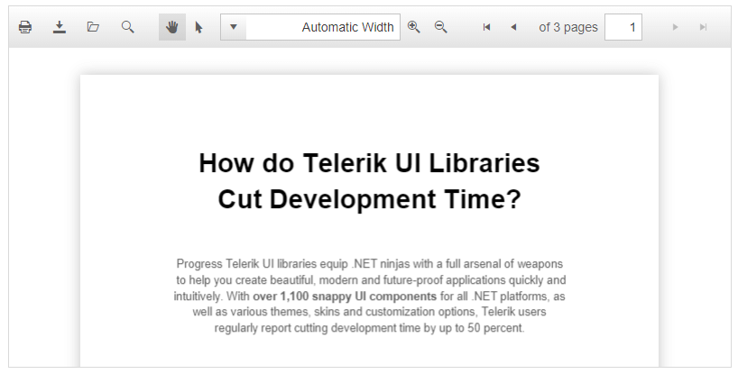

# Right-to-Left Support

The **RadPDFViewer** fully supports right-to-left (RTL) language locales (**Figure 1**). In order to turn on the RTL support you should set **dir=rtl** to the html or body element or at least to its parent element (**Figure 1**).  You can also use the **direction:rtl** CSS property. 

>caption Figure 1: RadPDFViewer in RTL mode.



>caption Example 1: Set the "direction: rtl" style to the **RadPDFViewer**'s wrapper element in order to enable the RTL support for the control.

````ASP.NET
<div dir="rtl" runat="server">
    <telerik:RadPdfViewer runat="server" ID="RadPdfViewer1" Height="450px" Width="1000px"
        Skin="Default" RenderMode="Lightweight">
        <PdfjsProcessingSettings File="Document1.pdf">
        </PdfjsProcessingSettings>
    </telerik:RadPdfViewer>
</div>
````

## See Also

 * [Keyboard Support]()


