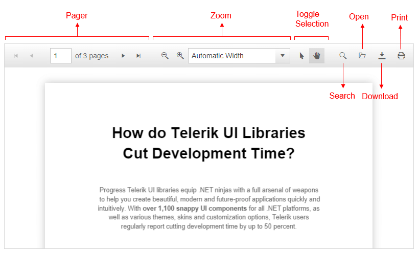

# Toolbar and Tools

Internally, the PDFViewer uses the [Kendo UI for jQuery Toolbar](https://docs.telerik.com/kendo-ui/controls/navigation/toolbar/overview) and provides a set of default tools and corresponding commands in its toolbar.

This approach enables you to use the [ToolBar API](https://docs.telerik.com/kendo-ui/api/javascript/ui/toolbar) and perform all available customizations.

In this article you will find the following sections:
  - [Built-in Tools](#built-in-tools)
  - [Basic Toolbar Configuration](#basic-toolbar-configuration)
  - [Add Custom tools](#add-custom-tool)
  - [See Also](#see-also)

>caption Figure 1: The built-in tools in the PdfViewer Toolbar




## Built-in Tools
You can control the number and type of the rendered tools by initializing the items collection only with the tools that you require. For the full list of configuration options, refer to the [client-side API of the ToolBar items](https://docs.telerik.com/kendo-ui/api/javascript/ui/pdfviewer/configuration/toolbar.items). 

The toolbar collection includes the following built-in tools:
 * `pager`
 * `zoom`
 * `toggleSelection`
 * `search`
 * `open`
 * `download`
 * `print`

>note Running an Adblock extension in Chrome might treat the new browser tab for the print dialog as a potential ad and block it.

## Basic Toolbar Configuration

The following example demonstrates basic configuration options for the PDFViewer toolbar tools. You can also add spacer elements, in order to group a preferable set of tools.

>caption Example 1: Specify the desired tools in the PdfViewer toolbar.
    
````ASP.NET
<telerik:RadPdfViewer runat="server" ID="RadPdfViewer1" Height="550px" Width="800px" Scale="0.9">
    <PdfjsProcessingSettings File="Document.pdf"></PdfjsProcessingSettings>
    <ToolBarSettings Items="pager, spacer, zoom, toggleSelection, spacer, search, open, download, print" />
</telerik:RadPdfViewer>
````

You can also use the `add` and `remove` client-side API methods to programmatically manage the rendered tools in the PDFViewer.

>caption Example 2: Add/Remove a Built-in Tool
````ASP.NET
<script>
    function onLoad(pdfViewer, args) {
        pdfViewer.get_toolBar().remove("print")
    }
</script>
<telerik:RadPdfViewer runat="server" ID="RadPdfViewer2" Height="550px" Width="800px">
    <ClientEvents OnLoad="onLoad" />
    <PdfjsProcessingSettings File="Document.pdf"></PdfjsProcessingSettings>
</telerik:RadPdfViewer>
````

## Add Custom Tools

You can add custom tools to the item collections of the toolbar.

>caption Example 3: Add custom button to the PdfViewer toolbar.
    
````CSS
<style>
    .logo-image {
        background-image: url("progress.png");
        width: 24px;
        height: 24px;
    }
</style>
````

```JavaScript
<script type="text/javascript" src="https://cdnjs.cloudflare.com/ajax/libs/pdf.js/2.2.2/pdf.js"></script>
<script type="text/javascript">
    window.pdfjsLib.GlobalWorkerOptions.workerSrc = 'https://cdnjs.cloudflare.com/ajax/libs/pdf.js/2.2.2/pdf.worker.js';

    function pageLoad(app, args) {
        var pdfViewer = $find('<%= RadPdfViewer1.ClientID %>');
        pdfViewer.addToolBarItem({
            template: $telerik.$("#template").html()
        });
        pdfViewer.addToolBarItem({
            type: "spacer"
        });
        pdfViewer.addToolBarItem({
            type: "spacer"
        });
        pdfViewer.addToolBarItem({
            type: "button",
            text: "Send an E-Mail",
            click: function (e) {
                alert(e.target.text() + " is clicked");
            }
        });
    }
</script>
```

```ASP.NET
<script type="text/template" id="template">
    <a href="https://www.progress.com/telerik" data-overflow="auto" class="logo-image" target="_blank" />
</script>

<telerik:RadPdfViewer runat="server" ID="RadPdfViewer1" Height="400px" Width="800px" Scale="1.2">
    <PdfjsProcessingSettings File="Document.pdf"></PdfjsProcessingSettings>
    <ToolBarSettings Items="pager, spacer" />
</telerik:RadPdfViewer>
```

## See Also

* [Live Demo - Toolbar Templates](http://demos.telerik.com/aspnet-ajax/pdfviewer/toolbartemplates/defaultcs.aspx)


