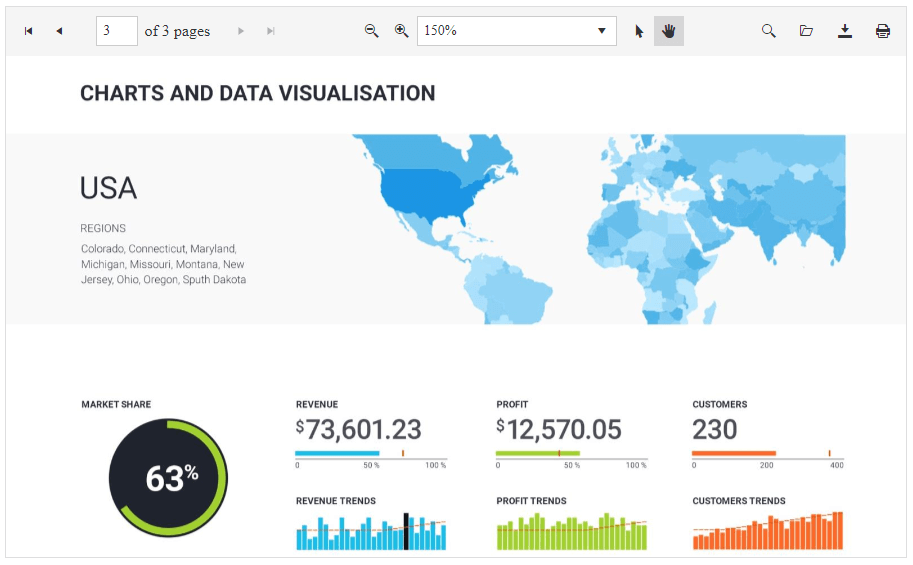

# Getting Started 

The following tutorial demonstrates how you can add a **RadPdfViewer** control populated with static items. The end result will be similar to **Figure 1**:

>caption Figure 1: Basic RadPdfViewer configuration with static items

1. Add a **ScriptManager** control on a Web Form.

2. Register the Pdf.js library on the page:  

    **JavaScript**
    
        
        

3. Add a **RadPdfViewer** control to the page, and set its properties:

    * `PdfjsProcessingSettings` - specify the desired PDF.js settings, like the `File` which will be loaded.
    * `Scale` - you can set the initial scale level of the pages here.
    * Set other properties like `ActivePage`, `Height` and `Width` to control its appearance as desired.
        
    The end result should be similar to the following:

    **ASPX**
    
            <telerik:RadPdfViewer runat="server" ID="RadPdfViewer1" RenderMode="Lightweight" Height="550px" Width="900px" Scale="1.5" ActivePage="3" >
                <PdfjsProcessingSettings File="Document1.pdf">
                </PdfjsProcessingSettings>
            </telerik:RadPdfViewer>

