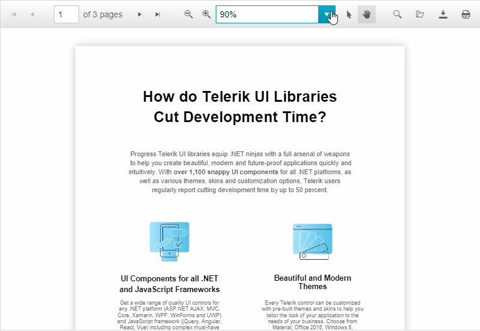

# PDFViewer Overview

**RadPdfViewer** is available as of R1 2020 SP1 and it is a server-side WebForms wrapper over the [PDFViewer for Kendo UI](https://docs.telerik.com/kendo-ui/controls/PDF/PDFViewer/overview) for jQuery widget.

It operates on the client, displays PDF files in the browser and consists of a toolbar and a scrollable container that wraps the page elements. The default tools collection includes the pager, open and download tools. The PDFViewer provides full control over the rendering of its tools toolbar items and tools.

>caption Figure 1: RadPdfViewer allows to open, navigate through and download a PDF file

## Key Features

* Renders and operates on the client-side

* Fully responsive design

* Built-in accessibility, WAI-ARIA, keyboard and RTL support

* [Localization]()

* Customizable [Toolbar and Tools]()

* Integration with [PDF.js]() Processing library

* Built-in paging, zooming and seraching mechanism

* Virtualization

* Ability to load files from the client's PC

* Built-in file download functionality

* Rich [client-side API]() and [events]()

# See Also

 * [Overview demo](http://demos.telerik.com/aspnet-ajax/pdfviewer/overview/defaultcs.aspx)

