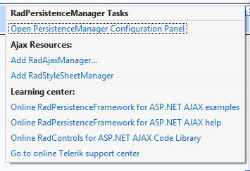

# PersistenceFramework Design Time

From the SmartTag for **RadPersistenceManager** you can access the control's configuration wizard which can be used to setup which controls' state should	be persisted.

Also, you can access the Telerik controls SmartTag standard features:

* **AjaxResources** - Shortcuts for quickly adding **RadAjaxManager**, **RadScriptManager**, **RadStyleSheetManager** to the **WebPage**.

* Learning Center - Links to online resources (examples, help articles, etc) for the control
