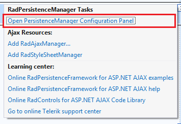
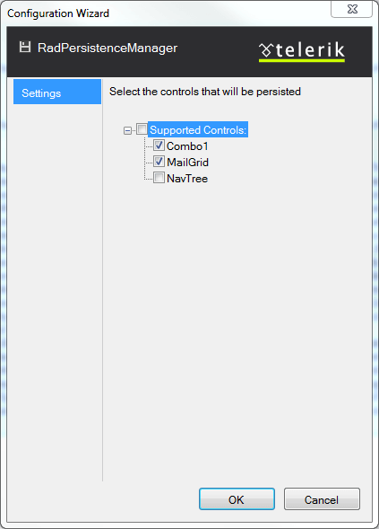

# Getting Started Overview


The below tutorial will walk you through enabling a state persistence for a page containing several Telerik controls.

1. Drag a **RadPersistenceManager** from the Visual Studio **Toolbox** onto your web page.

2. The [Smart Tag]() should appear automatically. From there, choose **Open PersistenceManager configuration wizard**.

	

3. In the **Configuration Wizard** window select the controls which state should be persisted.

	

4. Add button controls that will be used to trigger the **Save** and **Load** methods of **RadPersistenceManager**

````ASP.NET
<telerik:RadPersistenceManager id="RadPersistenceManager1" runat="server">
	.......
</telerik:RadPersistenceManager>

<telerik:RadButton RenderMode="Lightweight" ID="saveBtn" Text="Save State" runat="server" Width="67px" OnClick="saveBtn_Click">
</telerik:RadButton>
<telerik:RadButton RenderMode="Lightweight" ID="loadBtn" Text="Load State" runat="server" Width="67px" OnClick="loadBtn_Click">
</telerik:RadButton>
````
````C#
protected void loadBtn_Click(object sender, EventArgs e)
{
	RadPersistenceManager1.LoadState();
}

protected void saveBtn_Click(object sender, EventArgs e)
{
	RadPersistenceManager1.SaveState();
}
````
````VB
Protected Sub loadBtn_Click(sender As Object, e As EventArgs)
	RadPersistenceManager1.LoadState()
End Sub

Protected Sub saveBtn_Click(sender As Object, e As EventArgs)
	RadPersistenceManager1.SaveState()
End Sub
````


## See Also

 * [Persistence Framework online demos](https://demos.telerik.com/aspnet-ajax/persistence-framework/examples/overview/defaultcs.aspx)
