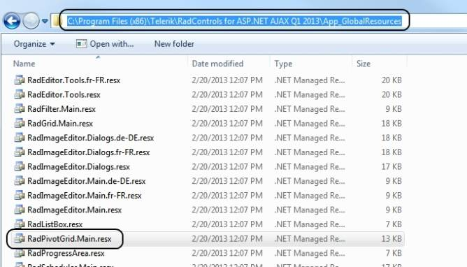
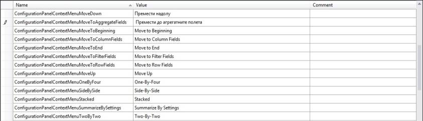

# Localization through global resources


__RadPivotGrid__ supports built-in localization through Global resources. Similar to __RadEditor__, __RadScheduler__ and __RadGrid__,____you can use the resx files to localize the control with minimum efforts.

## Using the resource files

The resource files should be placed within the __App_GlobalResources__folder in your application. You can either create your own language pack (see below) or use an existing one (if available for your language). UI controls installation wizard automatically copies the built-in resources to the __App_GlobalResources__ in your local installation.

To change the current language/resource you should set the __Culture__ property accordingly.

>note RadPivotGrid's default __Culture__ is taken from the page's __CurrentUICulture__ .
>


````ASPNET
	        <telerik:RadPivotGrid ID="RadPivotGrid1"    runat="server"    Culture="en-US" ... </telerik:RadPivotGrid>
````


Here is how to localize your __RadPivotGrid__ in simple steps:

1. Create a new resource file or copy an existing one from the __App_GlobalResources__ in your installation folder

1. Add the resource file (__resx__) file to the __App_GlobalResources__ folder in your application. Note that you should have two files as a bare minimum - __RadPivotGrid.Main.resx__ and the localization file itself - for example __RadPivotGrid.Main.bg-BG.resx__

1. Set the __Culture__ property to the corresponding language (for example: it-IT, en-GB, ja-JP and so on)

## Creating/Modifying resource files

The resource files are represented in a human-readible format (XML) and can be easily modified either in the built-in Visual Studio resource editor or directly in the file, by hand.

## How to create a new localization resource

The process of creating a new global resource follows the same pattern as in __RadEditor__, __RadScheduler__ and __RadGrid__ controls.

1. Make a copy of the __RadPivotGrid.Main.resx__ file and save it as __RadPivotGrid.Main.YOURLANGUAGE.resx__ (for example: __RadPivotGrid.Main.ja-JP.resx__)

1. Replace the default strings with the translated ones

1. Set the __Culture__ property to the relevant language

>caution Please __ -do not- __ modify/remove the __ReservedResource__ key.
>


>note We encourage that you submit your localized resource files. Your efforts will be rewarded accordingly.
>


You can find a complete list of the culture codes [here](http://sharpertutorials.com/list-of-culture-codes/).
