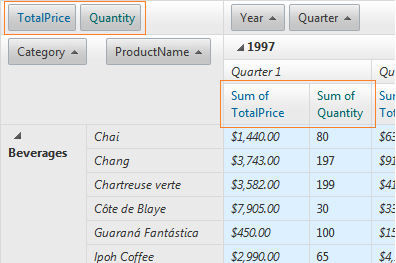

# Conditional Formatting


There are various ways to access groups of cells or specific ones to provide special formatting on them based on the contained value, their data field, or other property.

## 

The two main events to use for customizing cell appearance are PreRender and CellDataBound:

* __CellDataBound__ server event is fired for each cell that is bound inside RadPivotGrid. In it you can check the cell type, which field it belongs to what is its content, etc. Based on this, you can apply a style property to the cell or assign it a CssClass and then style it as per your requirement. You can use this event for scenarios where the styling would be applied on per cell basis and would depend only on the content of the current cell.

* __PreRender__ is fired on each postback, no matter if triggered by an action in RadPivotGrid or an external control. In it, you can either access a group of items / cells and customize them one by one, or you can loop through them and check a given property until you find a specific one that you want to style. Again, you have the choice to either use the style properties of the TableCell object or to assign a CssClass and apply your own styles.

The [Conditional Formatting](http://demos.telerik.com/aspnet-ajax/pivotgrid/examples/appearance/conditionalformatting/defaultcs.aspx) online demo demonstrates some of the possible ways to access and style cells based on their type or some other condition. Below follow code excerpts from it with a description of what they do exactly.

## Examples

* __Formatting cells in CellDataBound__All snippets by the end of this section are contained in the following event handler:


````C#
	    protected void RadPivotGrid1_CellDataBound(object sender, PivotGridCellDataBoundEventArgs e)
	    {
	        //give a color to the various cells cells
	        if (e.Cell is PivotGridDataCell)
	        {
	            PivotGridDataCell cell = e.Cell as PivotGridDataCell;
	            //CODE SNIPPET FOLLOWS HERE
````
````VB.NET
	    Protected Sub RadPivotGrid1_CellDataBound(sender As Object, e As PivotGridCellDataBoundEventArgs)
	        'give a color to the various cells cells
	        If TypeOf e.Cell Is PivotGridDataCell Then
	            Dim cell As PivotGridDataCell = TryCast(e.Cell, PivotGridDataCell)
	            'CODE SNIPPET FOLLOWS HERE
````


1. *__Coloring the data aggregate cells__*The sample below shows how you can apply styling to all data cells displaying the aggregate values for a given match of column and row fields. It also shows how to use the ParentColumnIndexes to recognize which column field the cell belongs to.


````C#
	            if (cell.CellType == PivotGridDataCellType.DataCell)
	            {
	                cell.BackColor = Color.FromArgb(220, 240, 255);
	                if (cell.ParentColumnIndexes[2].ToString() == "Sum of TotalPrice")
	                {
	                    cell.Font.Italic = true;
	                }
	            }
````
````VB.NET
	            If cell.CellType = PivotGridDataCellType.DataCell Then
	                cell.BackColor = Color.FromArgb(220, 240, 255)
	                If cell.ParentColumnIndexes(2).ToString() = "Sum of TotalPrice" Then
	                    cell.Font.Italic = True
	                End If
````
The result of the above code is light blue background for all data cells:and italic text style for those that are shown under the TotalPrice column.

1. *__Coloring the column and row total cells__*You can get the column and row total cells and apply styles to them based on various criteria. The following code applies different background color to the cells based on the data field they are calculated for and the actual values contained in them.


````C#
	                if (cell.CellType == PivotGridDataCellType.ColumnTotalDataCell || cell.CellType == PivotGridDataCellType.RowTotalDataCell)
	            {
	                switch ((cell.Field as PivotGridAggregateField).DataField)
	                {
	                    case "TotalPrice":
	                        if (cell.DataItem.ToString().Length > 0)
	                        {
	                            int price = Convert.ToInt32(cell.DataItem);
	                            if (price > 10000)
	                            {
	                                cell.BackColor = Color.FromArgb(0, 102, 102);
	                            }
	                            else if (price > 5000)
	                            {
	                                cell.BackColor = Color.FromArgb(0, 153, 153);
	                            }
	                            else
	                            {
	                                cell.BackColor = Color.FromArgb(0, 204, 204);
	                            }
	                        }
	                        break;
	                }
	            }
````
````VB.NET
	            ElseIf cell.CellType = PivotGridDataCellType.ColumnTotalDataCell OrElse cell.CellType = PivotGridDataCellType.RowTotalDataCell Then
	                Select Case TryCast(cell.Field, PivotGridAggregateField).DataField
	                    Case "TotalPrice"
	                        If cell.DataItem.ToString().Length > 0 Then
	                            Dim price As Integer = Convert.ToInt32(cell.DataItem)
	                            If price > 10000 Then
	                                cell.BackColor = Color.FromArgb(0, 102, 102)
	                            ElseIf price > 5000 Then
	                                cell.BackColor = Color.FromArgb(0, 153, 153)
	                            Else
	                                cell.BackColor = Color.FromArgb(0, 204, 204)
	                            End If
	                        End If
	                        Exit Select
	                End Select
````
The code above results in the following formatting for column totals:and for row totals as well:

1. *__Coloring the column and row grand total cells__*Coloring the column and row grand total cells follows the same logic as the total cells. Below follows a sample which demonstrates how styling can be applied to the row grand total cells for a given field:


````C#
	                else if (cell.CellType == PivotGridDataCellType.RowGrandTotalDataCell || cell.CellType == PivotGridDataCellType.ColumnGrandTotalDataCell)
	            {
	                switch ((cell.Field as PivotGridAggregateField).DataField)
	                {
	                    case "Quantity":
	                        double quantity = Convert.ToDouble(cell.DataItem);
	                        if (quantity > 5000)
	                        {
	                            cell.BackColor = Color.FromArgb(0, 153, 204);
	                        }
	                        else
	                        {
	                            cell.BackColor = Color.FromArgb(153, 204, 255);
	                        }
	                        break;
	
	                }
	            }
````
````VB.NET
	            ElseIf cell.CellType = PivotGridDataCellType.RowGrandTotalDataCell OrElse cell.CellType = PivotGridDataCellType.ColumnGrandTotalDataCell Then
	                Select Case TryCast(cell.Field, PivotGridAggregateField).DataField
	                    Case "Quantity"
	                        Dim quantity As Double = Convert.ToDouble(cell.DataItem)
	                        If quantity > 5000 Then
	                            cell.BackColor = Color.FromArgb(0, 153, 204)
	                        Else
	                            cell.BackColor = Color.FromArgb(153, 204, 255)
	                        End If
	                        Exit Select
	                End Select
````


1. *__Formatting the column and row headers based on their nested level__*You can use __ParentIndexes__ property which returns an array of the names of parent fields of a given header cell. In the below example, based on the length of the array, we differentiate the nested level of the headers and provide different styling for different levels.


````C#
	        else if (e.Cell is PivotGridRowHeaderCell)
	        {
	            PivotGridRowHeaderCell cell = e.Cell as PivotGridRowHeaderCell;
	            if (cell.ParentIndexes != null && cell.ParentIndexes.Length == 1)
	            {
	                cell.Font.Bold = true;
	            }
	            else
	            {
	                cell.Font.Italic = true;
	            }   
	        }
	
	        else if (e.Cell is PivotGridColumnHeaderCell)
	        {
	            PivotGridColumnHeaderCell cell = e.Cell as PivotGridColumnHeaderCell;
	            if (cell.ParentIndexes != null)
	            {
	                if (cell.ParentIndexes.Length == 1)
	                {
	                    cell.Font.Bold = true;
	                }
	                else if (cell.ParentIndexes.Length == 2)
	                {
	                    cell.Font.Italic = true;
	                }
	            }
	        }
````
````VB.NET
	        ElseIf TypeOf e.Cell Is PivotGridRowHeaderCell Then
	            Dim cell As PivotGridRowHeaderCell = TryCast(e.Cell, PivotGridRowHeaderCell)
	            If cell.ParentIndexes IsNot Nothing AndAlso cell.ParentIndexes.Length = 1 Then
	                cell.Font.Bold = True
	            Else
	                cell.Font.Italic = True
	            End If
	
	        ElseIf TypeOf e.Cell Is PivotGridColumnHeaderCell Then
	            Dim cell As PivotGridColumnHeaderCell = TryCast(e.Cell, PivotGridColumnHeaderCell)
	            If cell.ParentIndexes IsNot Nothing Then
	                If cell.ParentIndexes.Length = 1 Then
	                    cell.Font.Bold = True
	                ElseIf cell.ParentIndexes.Length = 2 Then
	                    cell.Font.Italic = True
	                End If
	            End If
	        End If
````


* __Formatting cells in PreRender__In PreRender you can access groups of items/cells, as they are all already created. An example of accessing all aggregate fields (the items/cells used to indicate the name of the fields that are aggregated). The __CellStyle__ setting is applied to the aggregate fields under the column headers, while __RenderingControl__references the items shown in the data zone.


````C#
	        else if (e.Cell is PivotGridRowHeaderCell)
	        {
	            PivotGridRowHeaderCell cell = e.Cell as PivotGridRowHeaderCell;
	            if (cell.ParentIndexes != null && cell.ParentIndexes.Length == 1)
	            {
	                cell.Font.Bold = true;
	            }
	            else
	            {
	                cell.Font.Italic = true;
	            }   
	        }
	
	        else if (e.Cell is PivotGridColumnHeaderCell)
	        {
	            PivotGridColumnHeaderCell cell = e.Cell as PivotGridColumnHeaderCell;
	            if (cell.ParentIndexes != null)
	            {
	                if (cell.ParentIndexes.Length == 1)
	                {
	                    cell.Font.Bold = true;
	                }
	                else if (cell.ParentIndexes.Length == 2)
	                {
	                    cell.Font.Italic = true;
	                }
	            }
	        }
````
````VB.NET
	        ElseIf TypeOf e.Cell Is PivotGridRowHeaderCell Then
	            Dim cell As PivotGridRowHeaderCell = TryCast(e.Cell, PivotGridRowHeaderCell)
	            If cell.ParentIndexes IsNot Nothing AndAlso cell.ParentIndexes.Length = 1 Then
	                cell.Font.Bold = True
	            Else
	                cell.Font.Italic = True
	            End If
	
	        ElseIf TypeOf e.Cell Is PivotGridColumnHeaderCell Then
	            Dim cell As PivotGridColumnHeaderCell = TryCast(e.Cell, PivotGridColumnHeaderCell)
	            If cell.ParentIndexes IsNot Nothing Then
	                If cell.ParentIndexes.Length = 1 Then
	                    cell.Font.Bold = True
	                ElseIf cell.ParentIndexes.Length = 2 Then
	                    cell.Font.Italic = True
	                End If
	            End If
	        End If
````


# See Also

 * [Overview]()
