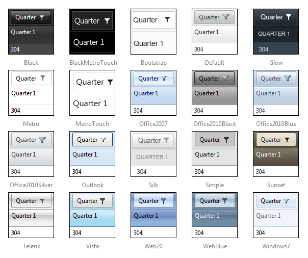

# Skins

RadPivotGrid uses skins to control its overall look-and-feel. A skin is a set of images and a CSS stylesheetthat can be applied to the control elements (items, images, etc.) and defines their look and feel. By default all controls in UI for ASP.NET AJAX suite have a polished look and feel which is consistent across the whole product line.

## Built-in skins

These are the skins provided by Telerik. They are embedded in the Telerik.Web.UI.Skins.dllassembly(except the Default one). To use a built-in skin the user only needs to set the __Skin__ property of the control.

Below is a set of the Telerik RadPivotGrid skins:

>note The __Hay__ , __Forest__ , __Sitefinity__ and __Transparent__ skins are obsolete and have been removed from the Telerik.Web.UI.Skins.dll assembly as of __Q1 2014__ .You can find more information on the matter in[this blog post](http://blogs.telerik.com/aspnet-ajax/posts/13-04-11/6-telerik-asp.net-ajax-skins-going-obsolete).
>

