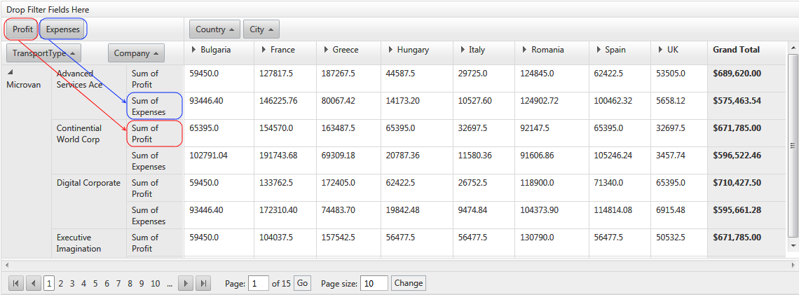

# Styling


## Styling Row/Column/Data table cells

Since Q3 2012 RadPivotGrid provides means to change how the columns, rows, and data cells looks.There are couple ways for changing the default style:

* Globally, through the *__ColumnHeaderCellStyle__*, *__RowHeaderCellStyle__*	and *__DataCellStyle__* properties of RadPivotGrid.

>tabbedCode

````ASPNET
			<ColumnHeaderCellStyle Width="300px" />
			<RowHeaderCellStyle Width="300p" />
			<DataCellStyle Width="300px" />
````


>end

* *__ColumnHeaderCellStyle__* – applies style to all pivotgrid’s column header table cells.

* *__RowHeaderCellStyle__* – applies style to all pivotgrid’s row header table cells.

* *__DataCellStyle__* – applies style to all pivotgrid’s data table cells.

* Or specifically for given field though the *__CellStyle__* property.

>tabbedCode

````ASPNET
				<telerik:PivotGridRowField DataField="TransportType" CellStyle-ForeColor="Red" CellStyle-Font-Size="Small">
				</telerik:PivotGridRowField>
````


>end

## Cases and specifics

If CellStyle and a some header style(RowHeaderCellStyle, ColumnHeaderCellStyle, or DataCellStyle) are both set, the CellStyle property takes precedense. The possible scenarios are as follows:

* AggregatePosition="Columns"

* One aggregate field:

* Two or more aggregate fields:

* AggregatePosition="Rows"

* One aggregate field:

* Two or more aggregate fields:
