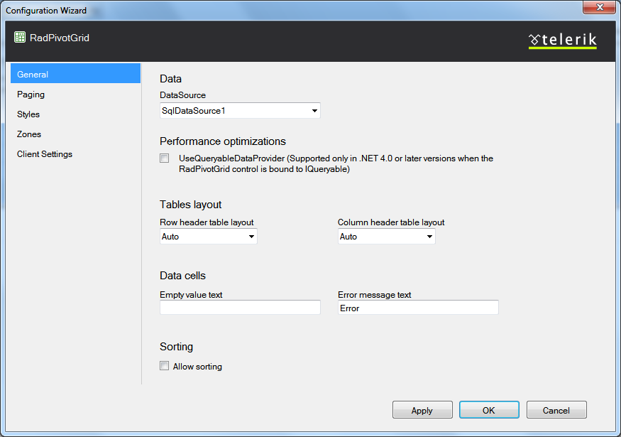
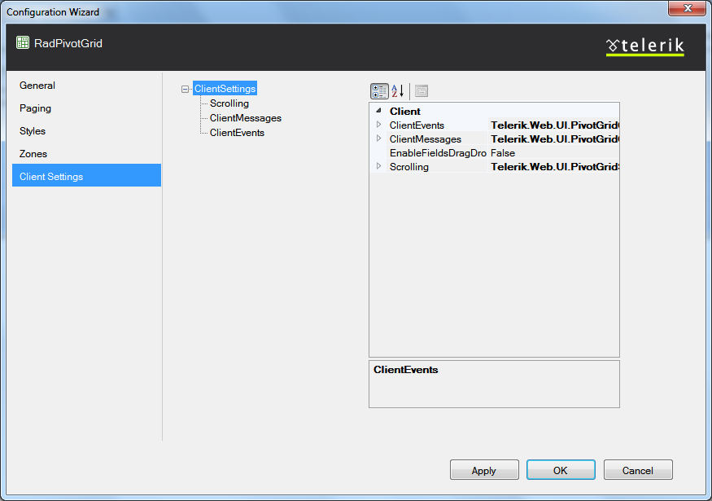

# Configuration Wizard

The __Configuration Wizard__ provides you with an easy and straight forward way for setting	up your RadPivotGrid control. You can set up and control the structure and main functionalities from here.

When you open the wizard, it shows the settings grouped by their purpose. You can navigate through the different	groups by using the menu on the left. Below follows a description of each set of settings:

## General

This is a group of settings that are not so tightly related but form the main structure and behavior of the control.They are:

* __Data__ - shows a dropdown where you can pick the ID of the declarative datasource towhich RadPivotGrid should be bound.

* __Performance optimizations__ - here you can enable the usage of a queryable data provider whenbinding RadPivotGrid in .NET 4.0 or later.

* __Tables layout__ - two dropdowns let you choose the table-layout setting of the tablesdisplaying the row and column headers.

* __Data cells__ - shows two textboxes. In the first one you can write a custom text which willappear when an aggregate cell has no value; in the second you can put in the text to show in aggregate cells whenthere was an error during calculation.

* __Sorting__ - displays a checkbox which you can use to enable and disable sorting in RadPivotGrid.

## Paging

These settings control the paging in RadPivotGrid. They are organized in two sections:

* __Paging__ - shows a checkbox used to enable and disable paging and a numeric box whichlets you set the page size of the control.

* __Page Navigation__ - allows you to customize the navigation options in the RadPivotGrid pager.The __Always show navigation__ checkbox is used to decide whether the pager will be displayedwhen the items in RadPivotGrid are less than the page size.There are also two dropdowns that let you choose the position of the pager inside the rendered pivot grid and itsmode.

For more information on paging in RadPivotGrid, see these articles:

[Basic Paging]()

[Pager Item]()

## Styles

Here you can customize the styles applied to RadPivotGrid. There is a separate property grid for the whole pivot grid andfor each logical structure of the control.

For informations and code samples of how you can apply custom styles based on different criteria inside RadPivotGrid,check [Conditional Formatting]().

## Zones

Here you can control the settings of the column, row and data header zones. They are listed as follows:

* __Show/Hide Zones__ - shows a checkbox which corresponds to the visibility of each of thethree header zones - column, row and data.

* __Zones Empty Message__ - allows you to provide a text for each zone which will be displayedin it if no fields are included in it.

* __ContextMenu__ - shows a checkbox allowing you to enable or disable the zone context menu.

You can see how zones and the zone context menu are used in the[First Look](http://demos.telerik.com/aspnet-ajax/pivotgrid/examples/firstlook/defaultcs.aspx)demo of RadPivotGrid.

## Client Settings

From here you can enable and disable all client features of the control, attach client events and control the text ofclient messages. This section shows a property grid for all ClientSettings in RadPivotGrid and for each sub class of settings - the ClientEvents, Scrolling settings, etc.
