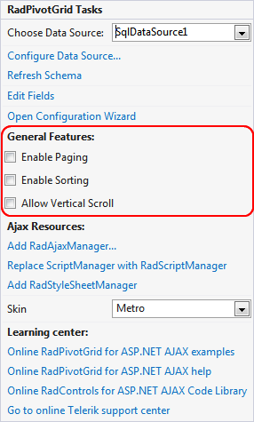

# Smart Tag

The RadPivotGrid Smart Tag provides convenient access to the most common settings for the	control. You can display the Smart Tag by right clicking on the RadPivotGrid in the design window,	and choosing the "Show Smart Tag" option from its context menu.

Below follows a description of all parts	of the Smart Tag and their usage.

## Choose Data Source and Configure Data Source

The **Choose Data Source** dropdown allows you to pick and change the declarative data source control used by RadPivotGrid. If you choose to create a new one, you will be allowed to pick a type and then the Configure Data Source wizard for the specific data source control will be shown. For more information on this see [Getting Started]().

The **Configure Data Source** link launches the Configure Data Source wizard for the current data source. This link does not appear in the Smart Tag unless the pivot grid is bound to a declarative data source.

## Edit Fields

The **Edit Fields** link opens the **PivotGridField Collection Editor** which allows you to add the Column, Row and Aggregate fields of your choice to RadPivotGrid. To learn more about the different types of Fields in RadPivotGrid, see [RadPivotGrid Fields]().

## Open Configuration Wizard

The **Open Configuration Wizard** link opens the **Configuration Wizard** forRadPivotGrid which allows you to set up the control features and appearance. See [Configuration Wizard]() for more information.

## General Features

The **General Features** section in the Smart Tag gives you fast access to the most commonly used features in RadPivotGrid. This way you can enable functionalities like paging and scrolling without the need of opening theConfiguration Wizard.

## Ajax Resources

The **Ajax Resources** section in the Smart Tag shows links that upon click will automatically add the respective manager control to the page and register any needed handlers for it in the web.config. This is a very easy way to add a RadScriptManager or RadStyleSheetManager to your page, without the need of writing anything in mark-up or the web configuration file.

## Skin

The **Skin** dropdown lets you choose a skin to be applied to RadPivotGrid. If you reference both Telerik.Web.UI.dll and Telerik.Web.UI.Skins.dll the drop down will show all embedded controls skins. If the latter is missing, you will only be able to select Default.

## Learning center

The **Learning center** lists the most important links that you may need during your development process - the documentation, demos, Code Libraries and a link that will take you to our online support center.

# See Also

 * [Getting Started]()

 * [Configuration Wizard]()
