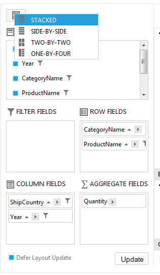
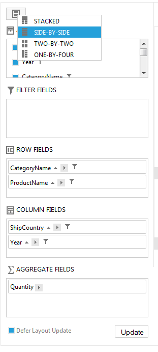
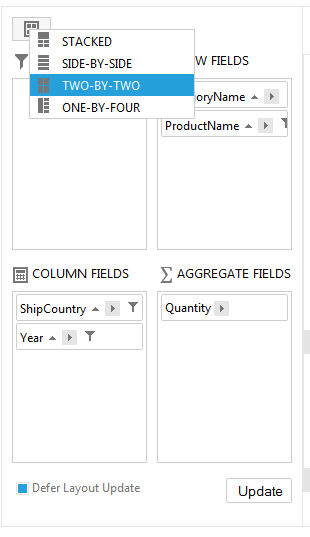
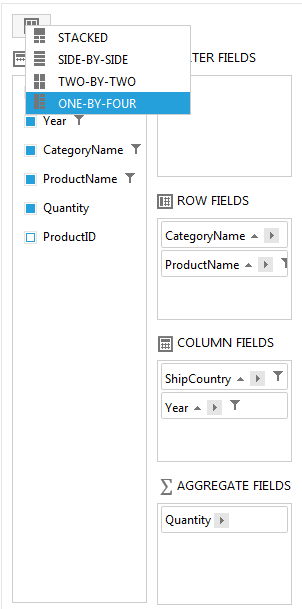

# Configuration Panel

The idea behind the **RadPivotGrid ConfigurationPanel** is taken from the **Excel PivotTable Field List** which enables fields sorting, reordering and hiding operations performed outside of the table which represents the data.Enabling such functionality gives the user ability to separate the logic for manipulating fields and displaying data.

>note Note that setting **ShowDataHeaderZone="false"** , **ShowColumnHeaderZone="false"** , **ShowRowHeaderZone="false"** , **ShowFilterHeaderZone="false"** will hide the fields positioned in the RadPivotGrid data table and leave only the fields in the configuration panel.
>

## RadPivotGrid ConfigurationPanelSettings

The **RadPivotGrid ConfigurationPanelSettings** property represents options for configuring the panel. The behavior of each property and its corresponding values are described below:

* **Position** - which determines the panel position relative to the RadPivotGrid control.

1. **FieldsWindow(default)** –places the panel in the RadPivotGrid FieldsWindow RadWindow control which could be shown by setting the EnableZoneContextMenu to true and clicking “Show Fields Window”.

2. **Up, Right, Down, Left** -values correspondingly place the panel up, right, down, left relative to the pivot table.

* **LayoutType** - the panel layout could be altered on the client and its default type could be altered by setting one of the four available values.

1. **Stacked, SideBySide** - includes all five available sections. The two types position the five sections differently as shown below.

1. **TwoByTwo, OneByFour** – includes four sections excluding the “Hidden fields” container. The two types position the four sections differently as shown below.

* **EnableDragDrop** - a Boolean property determining if fields could be dragged or not.

* **EnableFieldsContextMenu** - a Boolean property determining if the context menu of the field will be enabled.

* **DefaultDeferedLayoutUpdate** - determines if the Defer Layout Update will be enabled which will enable the **RadPivotGrid** to make rearrangements and sorting operations without a need for a postback. Updating all the pivot data is one click away.

* **OlapUncategorizedFolderName** - determines the name of category folder under which all uncategorized fields are placed.

* **FlattenOlapUncategoriezedFields** - gets/sets a value indicating if all uncategorized fields coming from OLAP cube will be placed under category folder or rendered directly as children.
