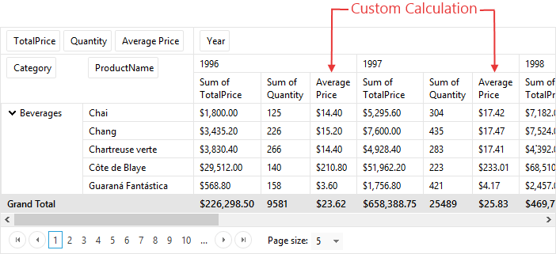
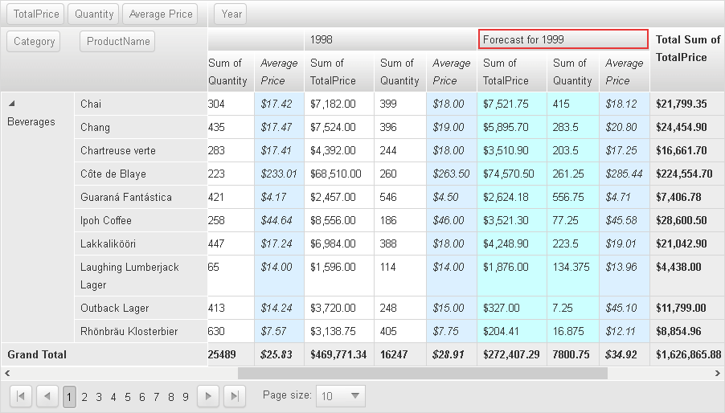

# Custom Data Calculations


## 

This article will cover the types of custom calculations supported by Telerik __RadPivotGrid__ control:

* Calculated Fields (type of AggregateField)

* Calculated Items

These calculations will help you generate efficient statistical reports in your production or business application depending on your specific requirements.

## Calculated Fields

The Calculated Fields, which are type of Aggregate Field, do not directly compute their cell values based on the __DataField__ from the data source. Instead, they use __CalculationDataFields__ for setting one or more required fields and thereby, they calculate the values using an expression based on these data fields (__Figure 1__).

````ASPNET
	   <telerik:PivotGridAggregateField DataField="Average Price"      
	     CalculationDataFields="TotalPrice,Quantity" CalculationExpression="{0}/{1}">
	   </telerik:PivotGridAggregateField>
````


__Figure 1: The Average Price field displays custom calculation depending on the used expression.__

In case you need a greater control over the calculations, you can also achieve the sample scenario demonstrated above programmatically, which will enable you to make further custom alterations dynamically using your specific conditions.

>tabbedCode

````ASPNET
	    <telerik:PivotGridAggregateField DataField="TotalPrice" Aggregate="Sum" 
	      DataFormatString="{0:C}">
	    </telerik:PivotGridAggregateField>
	    <telerik:PivotGridAggregateField DataField="Quantity" Aggregate="Sum">
	    </telerik:PivotGridAggregateField>
	    <telerik:PivotGridAggregateField DataField="Average Price" 
	      CalculationDataFields="TotalPrice,Quantity">
	    </telerik:PivotGridAggregateField>
````
````C#
	   protected void RadPivotGrid1_ItemNeedCalculation(object sender, 
	    PivotGridCalculationEventArgs e)
	    {
	        if (e.DataField == "Average Price")
	        {
	            AggregateValue totalPrice = e.GetAggregateValue("TotalPrice");
	            AggregateValue quantity = e.GetAggregateValue("Quantity");
	
	            if (totalPrice != null && quantity != null)
	            {
	                long totalPriceVal = (long)totalPrice.GetValue();
	                decimal quantityVal = (decimal)quantity.GetValue();
	
	                // Check for division by zero
	                if (quantityVal == 0)
	                {
	                    if (totalPriceVal == 0) // Result is NaN
	                    {
	                        e.CalculatedValue = new DoubleAggregateValue(0);
	                    }
	                    else // Result is Infinity
	                    {
	                        e.CalculatedValue = totalPrice;
	                    }
	                }
	                else
	                {
	                    double avg = (double)(totalPriceVal / quantityVal);
	                    e.CalculatedValue = new DoubleAggregateValue(avg);
	                }
	            }
	        }
	    }
````
````VB
	    Protected Sub RadPivotGrid1_ItemNeedCalculation(sender As Object, e As PivotGridCalculationEventArgs)
	        If e.DataField = "Average Price" Then
	            Dim totalPrice As AggregateValue = e.GetAggregateValue("TotalPrice")
	            Dim quantity As AggregateValue = e.GetAggregateValue("Quantity")
	
	            If totalPrice IsNot Nothing AndAlso quantity IsNot Nothing Then
	                Dim totalPriceVal As Long = CLng(totalPrice.GetValue())
	                Dim quantityVal As Decimal = CDec(quantity.GetValue())
	
	                ' Check for division by zero
	                If quantityVal = 0 Then
	                    If totalPriceVal = 0 Then
	                        ' Result is NaN
	                        e.CalculatedValue = New DoubleAggregateValue(0)
	                    Else
	                        ' Result is Infinity
	                        e.CalculatedValue = totalPrice
	                    End If
	                Else
	                    Dim avg As Double = CDbl(totalPriceVal / quantityVal)
	                    e.CalculatedValue = New DoubleAggregateValue(avg)
	                End If
	            End If
	        End If
	    End Sub
	#End Region
	
	#Region "pivotgrid-custom-data-calculations_1"
	    Protected Sub RadPivotGrid1_ItemNeedCalculation(sender As Object, e As PivotGridCalculationEventArgs)
	        If e.GroupName.ToString() = "Forecast for 1999" Then
	            'Calculation of AggregateSummaryValue for our CalculatedItem, based on the values from other items
	            Try
	                Dim interpolate As New LagrangeInterpolate()
	                interpolate.Add(1996, Double.Parse(e.GetAggregateSummaryValue(1996).GetValue().ToString()))
	                interpolate.Add(1997, Double.Parse(e.GetAggregateSummaryValue(1997).GetValue().ToString()))
	                interpolate.Add(1998, Double.Parse(e.GetAggregateSummaryValue(1998).GetValue().ToString()))
	
	                'Set new calculated value for given field.
	                e.CalculatedValue = New DoubleAggregateValue(Math.Max(interpolate.InterpolateX(1998.5), 0))
	            Catch generatedExceptionName As Exception
	                'If unable to predict the forecast, leave the cell empty.
	                e.CalculatedValue = Nothing
	            End Try
	        End If
	    End Sub
	#End Region
	
	End Class
	


>end

Note that even if you set the __CalculationExpression__ declaratively in the mark-up, you can still modify the default value of the __e.CalculatedValue__ property during the __ItemNeedCalculation__ event.

## Calculated Items

Calculated items are summary values that extend items from existing __GroupField__ (Row or Column field). You can define such items for each __PivotGridColumnField__ or __PivotGridRowField__ using their __CalculatedItems__ collection.

You can use Calculated Items to place a custom summary at the end of your products, month sales, orders by city, etc.

The following sample will calculate prediction values of products for the year 1999 using the information from the previous years. __Figure 2__ shows the result when we implement the logic demonstrated in the code snippets below.

>tabbedCode

````ASPNET
	    <telerik:PivotGridColumnField DataField="Year">
	        <CalculatedItems>
	           <telerik:PivotGridCalculatedItem 
	              GroupName="Forecast for 1999">
	           </telerik:PivotGridCalculatedItem>
	        </CalculatedItems>
	    </telerik:PivotGridColumnField>
````
````C#
	 protected void RadPivotGrid1_ItemNeedCalculation(object sender, 
	     PivotGridCalculationEventArgs e)
	    {
	        if (e.GroupName.ToString() == "Forecast for 1999")
	        {
	            //Calculation of AggregateSummaryValue for our CalculatedItem, based on the values from other items
	            try
	            {
	                LagrangeInterpolate interpolate = new LagrangeInterpolate();
	                interpolate.Add(1996, double.Parse(e.GetAggregateSummaryValue(1996).GetValue().ToString()));
	                interpolate.Add(1997, double.Parse(e.GetAggregateSummaryValue(1997).GetValue().ToString()));
	                interpolate.Add(1998, double.Parse(e.GetAggregateSummaryValue(1998).GetValue().ToString()));
	
	                //Set new calculated value for given field.
	                e.CalculatedValue = new DoubleAggregateValue(Math.Max(interpolate.InterpolateX(1998.5), 0));
	            }
	            catch (Exception)
	            {
	                //If unable to predict the forecast, leave the cell empty.
	                e.CalculatedValue = null;
	            }
	         }
	     }
````
````VB
	    Protected Sub RadPivotGrid1_ItemNeedCalculation(sender As Object, e As PivotGridCalculationEventArgs)
	        If e.GroupName.ToString() = "Forecast for 1999" Then
	            'Calculation of AggregateSummaryValue for our CalculatedItem, based on the values from other items
	            Try
	                Dim interpolate As New LagrangeInterpolate()
	                interpolate.Add(1996, Double.Parse(e.GetAggregateSummaryValue(1996).GetValue().ToString()))
	                interpolate.Add(1997, Double.Parse(e.GetAggregateSummaryValue(1997).GetValue().ToString()))
	                interpolate.Add(1998, Double.Parse(e.GetAggregateSummaryValue(1998).GetValue().ToString()))
	
	                'Set new calculated value for given field.
	                e.CalculatedValue = New DoubleAggregateValue(Math.Max(interpolate.InterpolateX(1998.5), 0))
	            Catch generatedExceptionName As Exception
	                'If unable to predict the forecast, leave the cell empty.
	                e.CalculatedValue = Nothing
	            End Try
	        End If
	    End Sub
	#End Region
	
	End Class
	


>end

__Figure 2: For a live demo of this sample please check the links in the Other Resources section.__

## SolveOrder property

Since *Q3 2014*, __PivotGridCalculatedItem__ exposes __SolveOrder__ property, which could be used in complex scenarios with multiple __CalculatedItems__, where one (or more) calculation(s) depend on the calculated values of other calculated items. With __SolveOrder__ property you can specify the order by which the calculations will be performed.

## Limitations

Currently, custom data calculations are not applicable for pivot Fields with defined __GroupInterval__ property.

# See Also

 * [Overview]()

 * [Live Demo](http://demos.telerik.com/aspnet-ajax-dev/pivotgrid/examples/calculations/defaultcs.aspx)

 * [Calculations]()
