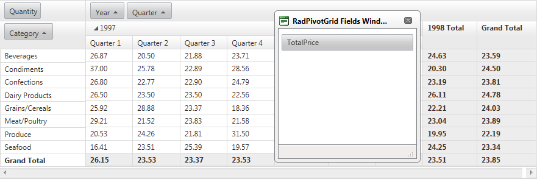

# Drag and Drop Fields


## 

As its predecessor RadPivotGrid provides Drag & Drop of fields functionality which allows the end user to display different results depending on their goals. It also ease the developers who are providing this functionality, because this is a built-in feature of RadPivotGrid.

In order to use the Drag/Drop functionality you need to enable the zone-context menu and to enable the fields reordering in the client settings:


````ASPNET
<telerik:RadPivotGrid RenderMode="Lightweight" runat="server" ID="RadPivotGrid1" OnNeedDataSource="RadPivotGrid1_NeedDataSource"
    ShowDataHeaderZone="true" ShowColumnHeaderZone="true" ShowRowHeaderZone="true"
    Width="100%" Skin="Default" EnableZoneContextMenu="true" AllowSorting="true">
    <fields>
    <telerik:PivotGridColumnField ZoneIndex="4" DataField="Year" Caption="Year" UniqueName="Year">
    </telerik:PivotGridColumnField>
    <telerik:PivotGridColumnField ZoneIndex="16" DataField="Quarter" Caption="Quarter"
        UniqueName="Quarter" DataFormatString="{0:F2}">
    </telerik:PivotGridColumnField>
    <telerik:PivotGridAggregateField ZoneIndex="0" DataField="Quantity" Caption="Quantity"
        UniqueName="Quantity" Aggregate="Average" DataFormatString="{0:F2}">
    </telerik:PivotGridAggregateField>
    <telerik:PivotGridRowField ZoneIndex="0" DataField="Category" Caption="Category"
        UniqueName="Category" DataFormatString="{0:F2}">
    </telerik:PivotGridRowField>
    <telerik:PivotGridRowField IsHidden="true" ZoneIndex="1" DataField="TotalPrice" Caption="TotalPrice"
        UniqueName="TotalPrice" DataFormatString="{0:F2}">
    </telerik:PivotGridRowField>
</fields>
    <clientsettings allowfieldsreordering="true">
    <ClientMessages DragToReorder="Drag the field to change its order" />
</clientsettings>
</telerik:RadPivotGrid>
````


Drag/Drop functionality is used through the context menu of the desired field. As soon as you right click on the field a list with the following options is shown:

* Refresh

* Hide

* Show Fields Window


To show hidden field you need to use the Fields Window and drag the desired field to its new location:


Possible scenarios that are achievable with the Drag/Drop functionality are:

* Show/hide fields from the results

* Change the order in which the fields are displayed

* Substitute columns/aggregates

# See Also

 * [Drag/Drop fields online demo](http://demos.telerik.com/aspnet-ajax/PivotGrid/Examples/DragDropFields/DefaultCS.aspx)
