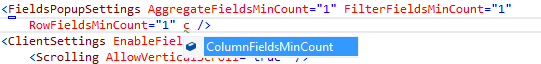

# Fields Popup

RadPivotGrid Fields Popup functionality enables grouping of zone fields in convenient popup which increases the space available for the table holding the pivot data. The feature could be enabled individually for each of the zones under the **RadPivotGrid.FieldsPopupSettings** property.

## 

The FieldsPopupSettings class exposes four properties:

* FilterFieldsMinCount

* AggregateFieldsMinCount

* ColumnFieldsMinCount

* RowFieldsMinCount

>note Note that any value different from the default zero will force the popup to appear if the count of thefields in the zone is bigger or equal to the specified one.
>

