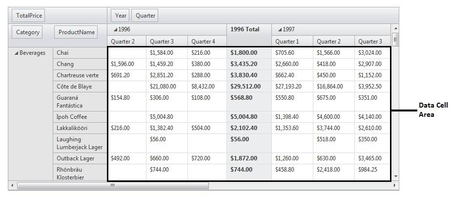
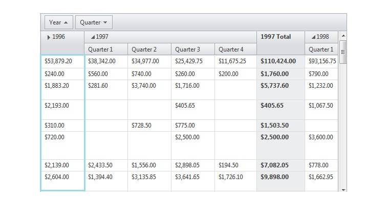
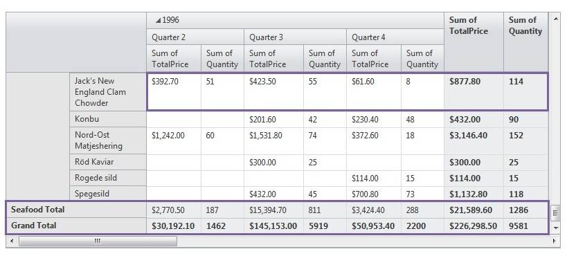

# Fields Overview

Pivot Grid Fields represent data source fields and provide specific data to RadPivotGrid. The Fields headers are used for presenting the different fields that can be moved between control areas using drag-and-drop.

## Fields:

To presents specific data in the RadPivotGrid, fields should be created and placed in the appropriated areas.

Here are the available fileds in RadPivotGrid:

* __DataFields__ - The PivotGrid calculates summaries against these fields. Visually they can be placed into the __Data Header Area__.

* __ColumnFields__ - The PivotGrid represents row headers from these fields. Visually they can be placed into the __Column Header Area__. The ColumnFields control the PivotGrid Columns which can be nested

* __RowFields__ - The PivotGrid represents column header from these fields. Visually they can be placed into the __Row Header Area__.

* __Drag and Drop Fileds__- different fields can be moved between control areas using drag-and-drop.

>note All these zones can be hidden and only the data cells with their corresponding column header cells and row header cells could be shown.
>

