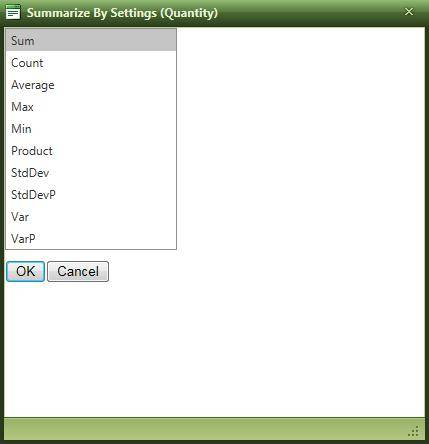

# Summarize By Settings Dialogue

## 

Changing the aggregate operator for a field in RadPivotGrid is done through the Summarize By Settings dialogue.Dedicated menu items have been added to the fields zone context menu and the fields configuration panel context menu to let open the Summarize By Settings window as shown below:

The Summarize By Settings Window contains a list box with all of the available aggregate functions. The user picks up one and clicks OK to reflect the change into the pivot data report:
