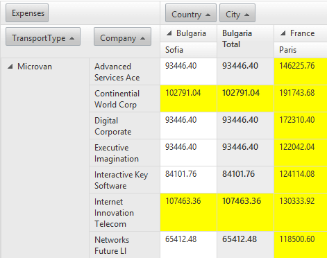
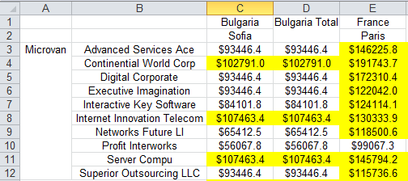

# Excel


From Q2 2013 we provide a new export format which is based on the binary Excel format BIFF. Our implementation supportsall versions of Microsoft Excel, starting from 2003. The Excel export is based on our "export infrastructure". It is a middle layer positioned between a server control (or user controlled) and a given export library. In this case, we have used it internally in RadGrid, RadTreeList and RadPivotGrid but every developer can take advantage of it.

## How to use it

The only thing that you need to do when you want to export the RadPivotGrid in excel is to call its server side ExportToExcel method:

RadPivotGrid1.ExportToExcel();

## Common properties and events

__Properties__

The ExportSettings group exposes several common properties which:

* __IgnorePaging__ - by default this property is __false__. If it is set to true the entiredata into the PivotGrid will be exported. Otherwise only the current page is exported.

* __OpenInNewWindow__ - by default, the exported file will be handled by the program associatedwith the appropriate file type. If you prefer to give the user the option to choose whether to save, open (inline) or cancel youshould enable this property.

>note Even if you set OpenInNewWindow="false", that doesn't guarantee that the file will be opened inside the browser window.The way the exported file will be displayed inline depends on the OS/browser settings. The end-user could manage the file extensions with programs like[NirSoft's FileTypesMan](http://www.nirsoft.net/utils/file_types_manager.html). For browsers, other than Internet Explorer, you should use the built-in settings.
>


* __FileName__ - this is helpful when you want to give a predefined name for your file.Please note that the file name can't be longer than 256 symbols. Unicode names are not supported out-of-the-box for __Internet Explorer6__ and __7__. Of course you can manually encode the file name and it will be shown properly in the "__Save__" dialog __(OpenInNewWindow="true").HttpUtility.UrlEncode ("unicode string", System.Text.Encoding.UTF8)__;

>note Internet Explorer ignores the FileName property when __OpenInNewWindow__ is set to __false__ .
>


__Events__

The RadPivotGrid exposes three events which can be used for customizing the exported file:

* __PivotGridExporting event__ - this event is usable when you want to access the binary data of the exported document.

* __PivotGridBiffExporting event__ - this event is useable in many scenarios when you want to modify the output file - for example you may want to add some custom information above RadPivotGrid or when you want to remove/add/replace parts of the content. Also into this event you haveas argument the entire __ExportStructure__. It allows you to add additional table into the structure which will be exported as differentsheet into the excel file.

* __PivotGridCellExporting event__ – this event is usable when you want to add formatting and styling options to the exported cell.

## Modifying exported excel’ cells formatting and applying styles to them

In order to apply formatting to the exported excel cells or to apply some styles to them you need to handle thePivotGridCellExporting event and to change the ExportedCell formatting or styles. For example the following code snippet adds currencyformat to all decimal cell, set width and if the value is bigger than 100000 sets yellow background:

>tabbedCode

````C#
	    protected void RadPivotGrid1_PivotGridCellExporting(object sender, PivotGridCellExportingArgs e)
	    {
	        PivotGridBaseModelCell modelDataCell = e.PivotGridModelCell as PivotGridBaseModelCell;
	        if (modelDataCell != null)
	        {
	            if (modelDataCell.Data != null && modelDataCell.Data.GetType() == typeof(decimal))
	            {
	                decimal value = Convert.ToDecimal(modelDataCell.Data);
	                if (value > 100000)
	                {
	                    e.ExportedCell.Style.BackColor = Color.Yellow;
	                }
	                e.ExportedCell.Format = "$0.0";
	                e.ExportedCell.Table.Columns[e.ExportedCell.ColIndex].Width = 11D;
	            }
	        }
	    }
````
````VB.NET
	    Protected Sub RadPivotGrid1_PivotGridCellExporting(sender As Object, e As PivotGridCellExportingArgs)
	        Dim modelDataCell As PivotGridBaseModelCell = TryCast(e.PivotGridModelCell, PivotGridBaseModelCell)
	        If modelDataCell IsNot Nothing Then
	            If modelDataCell.Data IsNot Nothing AndAlso modelDataCell.Data.[GetType]() = GetType(Decimal) Then
	                Dim value As Decimal = Convert.ToDecimal(modelDataCell.Data)
	                If value > 100000 Then
	                    e.ExportedCell.Style.BackColor = Color.Yellow
	                End If
	                e.ExportedCell.Format = "$0.0"
	                e.ExportedCell.Table.Columns(e.ExportedCell.ColIndex).Width = 11.0
	            End If
	        End If
	    End Sub
````
>end

>note The __Format__ property of the __ExportedCell__ object is the excel based cell format. For example:
>


The other parameter which is passed into the __PivotGridCellExporting__ is the model cell from which the export structure cells are built.The PivotGridBaseModelCell class contains information related with the PivotGrid cells:

* __Field__ - Gets the pivot grid field related with this cell

* __Data__ - Get the object to which the PivtoGrid cell is bound

* __GroupLevel__ - Gets the cell group level

* __IsCollapsed__ - Gets whether the cell's group is collapsed

* __HasChildren__ - Gets whether the cell's group has children groups

* __IsTotalCell__ - Gets whether the cell is total cell

* __IsGrandTotalCell__ - Gets whether the cell is grand total cell

* __CellType__ - Gets the type of data cell

* __TableCellType__ - Gets the type of cell

Since Q1 2015 version of UI for ASP.NET AJAX you can also access the __PivotGridCell__ object from the__PivotGridCellExporting__ arguments. You can cast the object to the appropriate type and use all its properties which will help you to changethe text apply different styles etc.

Additionally since Q1 2015 version you are able to style the elements of __RadPivotGrid__ by using the the builty-in styles such as__RowHeaderCellStyle__, __ColumnTotalCellStyle__ etc. It is important to note that you have to enable the__UseItemStyle__ property in order the applied styles to be exported. This property gives you the ability to apply the item styles to theexported file.

````ASPNET
	            <RowHeaderCellStyle BackColor="Green" />
	            <ColumnHeaderCellStyle BackColor="Yellow" ForeColor="Red"></ColumnHeaderCellStyle>
````


Another new approach is to hook __CellDataBound__ event handler and apply the styles in code behind. Note that styling via CSS classes is notpossible. This approach requires __UseItemStyles__ to be enabled as well.

>tabbedCode

````C#
	    protected void RadPivotGrid1_CellDataBound(object sender, PivotGridCellDataBoundEventArgs e)
	    {
	        if (e.Cell is PivotGridRowHeaderCell)
	        {
	            e.Cell.BackColor = Color.Blue;
	        }
	        else if(e.Cell is PivotGridColumnHeaderCell)
	        {
	            e.Cell.ForeColor = Color.Violet;
	        }
	        else if (e.Cell is PivotGridDataCell)
	        {
	            e.Cell.BackColor = Color.Gray;
	            e.Cell.ForeColor = Color.Pink;
	        }
	    }
````
````VB.NET
	    Protected Sub RadPivotGrid1_CellDataBound(sender As Object, e As PivotGridCellDataBoundEventArgs)
	        If TypeOf e.Cell Is PivotGridRowHeaderCell Then
	            e.Cell.BackColor = Color.Blue
	        ElseIf TypeOf e.Cell Is PivotGridColumnHeaderCell Then
	            e.Cell.ForeColor = Color.Violet
	        ElseIf TypeOf e.Cell Is PivotGridDataCell Then
	            e.Cell.BackColor = Color.Gray
	            e.Cell.ForeColor = Color.Pink
	        End If
	    End Sub
````
>end

## Modifying the Output

This is the most interesting and flexible functionality the new export brings to the table. Simply put, you have to handle the __PivotGridBiffExporting__ event and then make the desired modification to the structure (accessible via the __e.ExportStructure__ propertyof the event arguments), generated by RadPivotGrid.

>tabbedCode

````C#
	    //Adding new worksheet
	    xls.Table newSheet = new xls.Table("NEW SHEET");
	    e.ExportStructure.Tables.Add(newSheet);
	    newSheet.Cells[1, 1].Value = "NEW CELL";
````
````VB.NET
	    'Adding new worksheet
	    Dim newSheet As New xls.Table("NEW SHEET")
	    e.ExportStructure.Tables.Add(newSheet)
	    newSheet.Cells(1, 1).Value = "NEW CELL"
````
>end

## Limitations

* No automatic column/row resizing.
