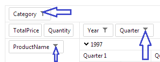

# Filtering

RadPivotGrid comes equipped with powerful filtering mechanism that supports three modes: report, label and value.

## Report filters

Report filters are applied on fields that do not participate in the grouping of the data but are still present in the underlying data source.

So, for example, if the data items grouped by RadPivotGrid feature a *Category* property with 100 unique values and the data should be grouped only by those items that fall within only a limited set of Categories (let’s say Books, Music, Video) but exclude *Category* from the properties the grid is being grouped by, then you should apply a report filter on the *Category* field.

In practice, report filters allow the exclusion of selected field items from the data prior to its grouping. In order for a pivot grid field to become eligible for report filtering it should be added to RadPivotGrid’s fields collection as a PivotGridReportField. That will effectively make it part of the grid’s filter zone and make report filtering applicable to it.

Filtering in RadPivotGrid is switched on/off by the __AllowFiltering__ property. When turned on it will make RadPivotGrid display a tiny filter image beside each field’s name.

This is the fields filter button which opens up the filter window.

The latter allows the user to exclude data items based on unique key values or apply a wide range of filter operators that fall within two categories: __Label__ and __Value__filters.

## Label filters

Label filters control which groups for a given field will remain in the pivot data view after grouping has been performed. If, for example, you have your data grouped by a *Country* field and you need only those *Country* groups of items that relate to Bulgaria you should apply an __Equals__ label filter to the *Country* field with the respective string filter value of “Bulgaria”.

Label filters are certainly applicable to both RadPivotGrid’s row and value fields.

## Value filters

Value filters, for their part, allow filtering operations to be performed on the aggregate results. Again, the filtering is applied after the grouping of the data. Here is another example: Suppose you have grouped your data by *Country*,aggregated it by *Sum of Cost* and need only those *Country* groups of items which cumulative cost falls within a certain range. Then you should apply a __Between__ value filter on the Country field with the corresponding filter values.

Value filters too are applicable to both RadPivotGrid’s row and value fields.

## Special filter functions

Whereas most filter operators are self-explanatory, the __Top__ and __Bottom__ ones might not be that obvious. Those operators allow three modes: __Items, Percent__ and __Sum__.

They also expect and aggregate field and a filter value as part of the overall filter condition.

When a __Top/Bottom__ value filter is applied to a given field with the __Items__ mode, it will select the top/bottom groups for that field sorted by the chosen aggregate field and the count of which is given by the filter value. For example, a Top operator with and Items filter value of 10 on the __Sum of Cost__ aggregate field will return the 10 groups (of the field filtered on) which Sum of Cost is greatest. The __Percent__ mode will return the top/bottom groups which cumulative aggregate values (just to remind: the aggregate field being set as part of the filter condition) add to the specified percent of the grand total for that field. The __Sum__ mode, in a similar fashion, gets the top/bottom groups which cumulative aggregate values add to the sum specified by the filter value.

## Filter dialogues

RadPivotGrid’s filtering UI consists of two dialogues. The one that opens first upon clicking a given field’s filter button allows the construction of set, label and value filters. If, however, a Top value filter is selected and extra filter dialogue is opened to take in additional parameters that are mandatory for the filter expression and have been explained above in *Special filter* functions.

## Filtering with OLAP data source

__RadPivotGrid__ does not currently support:

* Includes/Excludes label filter

* None of the label filters except for __Contains, Equals, DoesNotEqual__

* Special filters (Top/Bottom)
