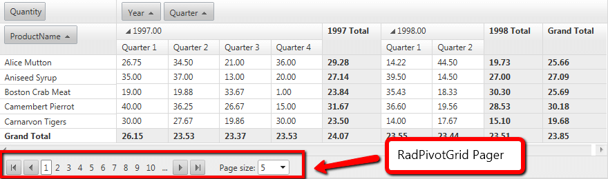

# Paging Overview

## 

**RadPivotGrid** has built-in pager functionality which is available out of the box and it is controlled with the AllowPaging property. Paging functionality allows the user to fetch and display data by chunks. This behavior provides better performance and ease of use for the user.

If the **AllowPaging** property is set to **True** the paging functionality will be enabled. By default the **AllowPaging** property has **False** value.

You could control how many items will be fetched and displayed by the **PageSize** property. This property is used by **RadPivotGrid** to split the returned result set of the data source.

**RadPivotGrid** supports different pager styles, that you could choose from. For more information see [this article]().

**RadPivotGrid** exposes the **PageSizeControlType** property in its **PagerStyle** property collection which is an enum of type **PagerDropDownControlType**. It has three values available with **RadComboBox** being the default one:

* **None**

* **RadComboBox**

* **RadDropDownList**

As it name implies, the property specifies what type of page size drop down control will be rendered.The property provides an easy way to switch off the page size combo or replace it with its light weight counterpart **RadDropDownList**.

# See Also

 * [Pager Item]()
