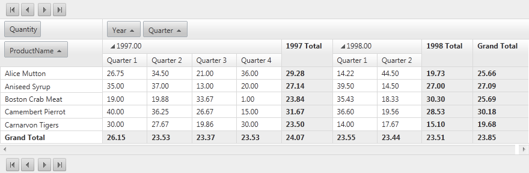

# Pager Item

Required introduction

## 

When paging functionality is enabled __RadPivotGrid__ renders pager item on bottom and/or on top of the control.

## PagerStyle

The appearance of the PagerItem could be fine tuned with the PagerStyle property of __RadPivotGrid__. In addition to the usual style properties like __ForeColor__, __BackColor__, __BorderStyle__ and others, PagerStyle includes a number of options that are unique to the pager item:

## Position

PagerStyle.Position property specify where the pager item will be displayed relatively to the RadPivotGrid. The list of possible option is as follows:

* __Top__

* __TopAndBottom__

* __Bottom__

## Mode

With the Mode property of the PagerStyle you could control what set of contorls to be displayed in the pager item. Possible options are:

* __NextPrev__

* __NumericPages__

* __NextPrevAndNumeric__

* __NextPrevNumericAndAdvanced__

* __Advanced__

* __Slider__

## Appearance

The appearance of the pager in RadPivotGrid could be controlled with the AlwaysVisible property. By default this property has a value of False. When the value is set to True pager item is displayed regardless of the item count.
