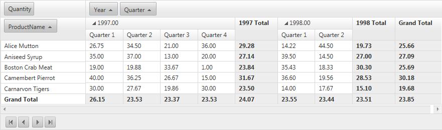

# Pager Item

Required introduction

## 

When paging functionality is enabled **RadPivotGrid** renders pager item on bottom and/or on top of the control.

## PagerStyle

The appearance of the PagerItem could be fine tuned with the PagerStyle property of **RadPivotGrid**. In addition to the usual style properties like **ForeColor**, **BackColor**, **BorderStyle** and others, PagerStyle includes a number of options that are unique to the pager item:

## Position

PagerStyle.Position property specify where the pager item will be displayed relatively to the RadPivotGrid. The list of possible option is as follows:

* **Top**

* **TopAndBottom**

* **Bottom**

## Mode

With the Mode property of the PagerStyle you could control what set of controls to be displayed in the pager item. Possible options are:

* **NextPrev**

* **NumericPages**

* **NextPrevAndNumeric**

* **NextPrevNumericAndAdvanced**

* **Advanced**

* **Slider**

## Appearance

The appearance of the pager in RadPivotGrid could be controlled with the AlwaysVisible property. By default this property has a value of False. When the value is set to True pager item is displayed regardless of the item count.
