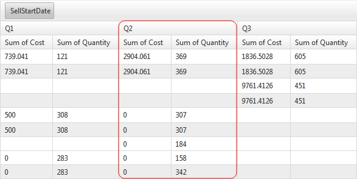

# Range Grouping


RadPivotGrid supports three types of grouping by ranges for its row and column fields: DateTime, numeric and custom.

## DateTime range grouping

RadPivotGrid can combine ranges of date time row/column groups into the following time spans: __Year__,__Quarter__, __Month__, __Day__.

In order to switch on this feature, just set the __GroupInterval__ property of the row/column fieldto the corresponding value given by the __PivotGridGroupInterval__ enumeration.

The following mark-up defines a column field that will combine groups containing SafetyLeveldata into four-monthperiods.

````ASPNET
							<telerik:PivotGridColumnField DataField="SellStartDate" GroupInterval="Quarter"
								ShowGroupsWhenNoData="false">
							</telerik:PivotGridColumnField>
````



## Numeric range grouping

RadPivotGrid also sports the capability to aggregate numeric row/column groups into custom numeric ranges. For anyfield that needs to combine its groups into numeric ranges, the __GroupInterval__ property should beset to __Numeric__ whereas the __GroupIntervalNumericRange__ should be give thenumeric span of the interval. The latter accepts double values.

The row field defined below will aggregate groups of SafetyLevel data into ranges as follows: 0-100, 100-200,200-300 etc.

````ASPNET
							<telerik:PivotGridRowField DataField="SafetyLevel" GroupInterval="Numeric"
								GroupIntervalNumericRange="100" ShowGroupsWhenNoData="false">
							</telerik:PivotGridRowField>
````


## ShowGroupsWhenNoData

The __ShowGroupsWhenNoData__ property is applicable to PivotGridRowField and PivotGridColumnField.	When this property is set to __false__(the default value), RadPivotGrid	will not display the empty (row/column) groups.

````ASPNET
							<telerik:PivotGridColumnField DataField="Make" ShowGroupsWhenNoData="false">
							</telerik:PivotGridColumnField>
							<telerik:PivotGridRowField DataField="Type" ShowGroupsWhenNoData="false">
							</telerik:PivotGridRowField>
````


## Custom range grouping

The last but not least range grouping feature of RadPivotGrid’s provides the flexibilityto implement a custom way of grouping any row/column field group values. The approach to customgrouping is programmatic and includes the creation of a new pivot grid field class that shouldinherit the __PivotGridColumnField__ (for column fields) or the__PivotGridRowField__ (for row fields) class. In the child class the__GroupDescription__ property should be overridden to return an instanceof a custom __GroupDescription__ class. The latter must inherit the__PropertyGroupDescription__ class and override the__GroupNameFromItem__ method where the custom grouping logic is to beimplemented.

The __GroupNameFromItem__ method must return a new instance of auser-defined class/struct object that implements the__IEquatable<T>__, __IComparable<T>__and __IComparable__ interfaces. The class/struct should also define ahash that’s unique for each group range and override the ToString() method to return theunique name for each group interval constructed in compliance with the custom grouping logic.

In addition, the __CreateInstanceCore__ method is to be overriden obligatorily to return a new instance of the custom group descritpion class.

Finally, when the custom group description class defines new properties, they have to be cloned inthe __CloneCore__ method.

An example of a custom-defined field that provides a specific, user-tailored range grouping is givenbelow. The __CustomDateTimeField__ will group date-time values into half-year periods.

>tabbedCode

````C#
	public class CustomDateTimeField : PivotGridColumnField
	{
	    private GroupDescription groupDescription;
	
	    public CustomDateTimeField()
	    {
	        //
	        // TODO: Add constructor logic here
	        //
	    }
	
	    public override GroupDescription GroupDescription
	    {
	        get
	        {
	            if (groupDescription == null)
	            {
	                groupDescription = new CustomDateTimeGroupDescription();             
	            }
	            return groupDescription;
	        }
	        set
	        {
	            base.GroupDescription = value;
	        }
	    }
	}
	
	public class CustomDateTimeGroupDescription : PropertyGroupDescriptionBase
	{
	    protected override object GroupNameFromItem(object item, int level)
	    {
	        var baseValue = base.GroupNameFromItem(item, level);
	        DateTime value = (DateTime)baseValue;
	        return new HalfYearGroup((value.Month) / 6 + 1);
	    }
	
	    protected override Cloneable CreateInstanceCore()
	    {
	        return new CustomDateTimeGroupDescription();
	    }
	
	    protected override void CloneOverride(Cloneable source)
	    {
	        CustomDateTimeGroupDescription castedSource = source as CustomDateTimeGroupDescription;
	        if (castedSource != null)
	        {
	            //clone any custom properties that are required by the custom group description class
	            // this.Step = castedSource.Step;
	        }
	    }
	}
	
	public class HalfYearGroup : IComparable, IComparable<HalfYearGroup>, IEquatable<HalfYearGroup>
	{
	    public HalfYearGroup()
	    {
	
	    }
	
	    internal HalfYearGroup(int half)
	    {
	        this.Half = half;
	    }
	
	    public int Half
	    {
	        get;
	        set;
	    }
	
	    public override string ToString()
	    {
	        return string.Format(CultureInfo.InvariantCulture.NumberFormat, "H{0}", this.Half);
	    }
	
	    public override int GetHashCode()
	    {
	        return this.Half * 7933;
	    }
	
	    public override bool Equals(object obj)
	    {
	        return this.Equals(obj as HalfYearGroup);
	    }
	
	    public int CompareTo(object obj)
	    {
	        if (obj is HalfYearGroup)
	        {
	            return this.CompareTo(obj as HalfYearGroup);
	        }
	
	        throw new ArgumentException("Can not compare.", "obj");
	    }
	
	    public int CompareTo(HalfYearGroup other)
	    {
	        if (other == null)
	        {
	            throw new ArgumentNullException("other");
	        }
	        return this.Half.CompareTo(other.Half);
	    }
	
	    public bool Equals(HalfYearGroup other)
	    {
	        return other != null && this.Half == other.Half;
	    }
	}
	
````


````VB.NET
	Public Class CustomDateTimeField
		Inherits PivotGridColumnField
		Private m_groupDescription As GroupDescription
	
		'
		' TODO: Add constructor logic here
		'
		Public Sub New()
		End Sub
	
		Public Overrides Property GroupDescription() As GroupDescription
			Get
				If m_groupDescription Is Nothing Then
					m_groupDescription = New CustomDateTimeGroupDescription()
				End If
				Return m_groupDescription
			End Get
			Set(value As GroupDescription)
				MyBase.GroupDescription = value
			End Set
		End Property
	End Class
	
	Public Class CustomDateTimeGroupDescription
		Inherits PropertyGroupDescriptionBase
		Protected Overrides Function GroupNameFromItem(item As Object, level As Integer) As Object
			Dim baseValue = MyBase.GroupNameFromItem(item, level)
			Dim value As DateTime = DirectCast(baseValue, DateTime)
			Return New HalfYearGroup((value.Month) / 6 + 1)
		End Function
	
		Protected Overrides Function CreateInstanceCore() As Cloneable
			Return New CustomDateTimeGroupDescription()
		End Function
	
		Protected Overrides Sub CloneOverride(source As Cloneable)
			Dim castedSource As CustomDateTimeGroupDescription = TryCast(source, CustomDateTimeGroupDescription)
			'clone any custom properties that are required by the custom group description class
			' this.Step = castedSource.Step;
			If castedSource IsNot Nothing Then
			End If
		End Sub
	End Class
	
	Public Class HalfYearGroup
		Implements IComparable
		Implements IComparable(Of HalfYearGroup)
		Implements IEquatable(Of HalfYearGroup)
	
		Public Sub New()
		End Sub
	
		Friend Sub New(half As Integer)
			Me.Half = half
		End Sub
	
		Public Property Half() As Integer
			Get
				Return m_Half
			End Get
			Set(value As Integer)
				m_Half = Value
			End Set
		End Property
		Private m_Half As Integer
	
		Public Overrides Function ToString() As String
			Return String.Format(CultureInfo.InvariantCulture.NumberFormat, "H{0}", Me.Half)
		End Function
	
		Public Overrides Function GetHashCode() As Integer
			Return Me.Half * 7933
		End Function
	
		Public Overrides Function Equals(obj As Object) As Boolean
			Return Me.Equals(TryCast(obj, HalfYearGroup))
		End Function
	
		Public Function CompareTo(obj As Object) As Integer
			If TypeOf obj Is HalfYearGroup Then
				Return Me.CompareTo(TryCast(obj, HalfYearGroup))
			End If
	
			Throw New ArgumentException("Can not compare.", "obj")
		End Function
	
		Public Function CompareTo(other As HalfYearGroup) As Integer
			If other Is Nothing Then
				Throw New ArgumentNullException("other")
			End If
			Return Me.Half.CompareTo(other.Half)
		End Function
	
		Public Function Equals(other As HalfYearGroup) As Boolean
			Return other IsNot Nothing AndAlso Me.Half = other.Half
		End Function
	End Class
	
````


>end

The result can be seen in the Range Grouping demo linked in the Related Resources section below.

# See Also

 * [Range Grouping Demo](http://demos.telerik.com/aspnet-ajax/pivotgrid/examples/rangegrouping/defaultcs.aspx)
