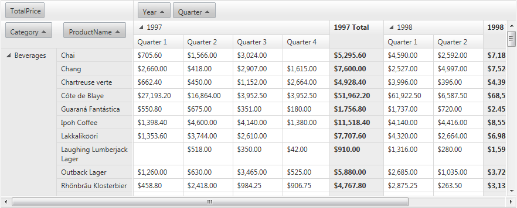

# Scrolling

When constructing a Web page that contains a RadPivotGrid, you may encounter a design limitations in case the RadPivotGrid has too many items. In such cases, you can easily make it scrollable by setting the __ClientSettings -> Scrolling -> AllowVerticalScroll__ property to __True__ (By default its value is __False__.) The Horizontal scroll is enabled by default and will appear when the total width of the columns exceeds the width of the pivotgrid(as demonstrated in [this online demo]()
).

The __ClientSettings->Scrolling->ScrollHeight__ property specifies the height value beyond which scrolling is turned on. The default value is 300px.

The __ClientSettings->Scrolling->SaveScrollPosition__ property keep the scroll position during postbacks.

When scrolling is enabled, scroll bars appear on the grid when the number of records it displays would cause it to exceed the value of __ScrollHeight__:

>note To optimize the RadPivotGrid loading time when scrolling is enabled, you may consider defining __ColumnHeaderCellStyle.Width__ and __RowHeaderCellStyle.Height__ properties. Thus the pivotgridwill not execute additional scripts for aligning.
>

