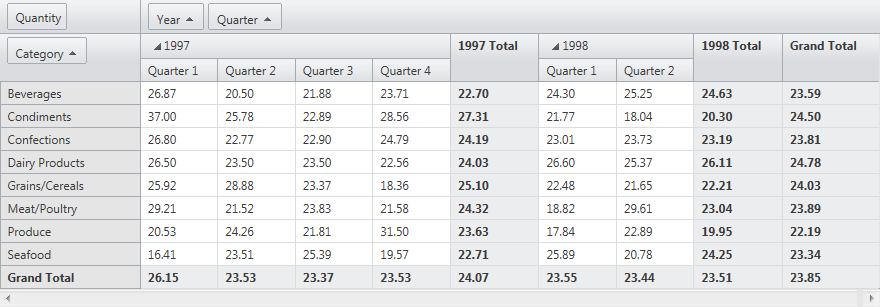

# Sorting


## 

__RadPivotGrid__ has a built in sorting functionality. To enable to sorting function in __RadPivotGrid__ you should set the __AllowSorting__ property to True. After that arrow buttons appear in row headers that are used to select a sort mode. List of the available options is:

* __Ascending__

* __Descending__

RadPivotGrid could sort columns and rows. By default when sorting is enabled, the results are returned in ascending order. The sorting operation is executed when you click on the field that you want to sort:

You could click on the field and the sort order will be changed. After clicking the field RadPivotGrid will return the sorted result set:

Since __Q1 2014 SP1__ version, __RadPivotGrid__ provides two additional improvements to its sorting functionality.

First option is to set the __AllowNaturalSort__ to True within the definition of the RadPivotGrid. When this property is enabled, each field will now have third possible order of its sorting state in addition to __Asc__ and __Desc__: __None__. When the __None__ sorting is active, the sort order will be determined by the original sort order from the datasource.

Second option is available only when the control is [ bound to an OLAP source](). __RadPivotGrid__ now provides a new __PrepareDescriptionForField__ event handler, which you can use to set __OlapGroupComparer__ for the description of each field that you want to sort naturally. This will enable you to sort numeric fields naturally as numbers instead of strings.

>tabbedCode

````C#
	    protected void RadPivotGrid1_PrepareDescriptionForField(object sender, PivotGridPrepareDescriptionForFieldEventArgs e)
	    {
	        // You can execute your logic only for fields that match a given condition
	        //if (e.Field.UniqueName == "MyFieldName")
	
	        var desc = e.Description as OlapGroupDescription;
	
	        if (desc != null)
	        {
	            desc.GroupComparer = new OlapGroupComparer();
	
	            foreach (OlapLevelGroupDescription levelGroupDescription in desc.Levels)
	            {
	                levelGroupDescription.GroupComparer = new OlapGroupComparer();
	            }
	        }
	    }
````


````VB.NET
	    Protected Sub RadPivotGrid1_PrepareDescriptionForField(sender As Object, e As PivotGridPrepareDescriptionForFieldEventArgs)
	        ' You can execute your logic only for fields that match a given condition
	        'if (e.Field.UniqueName == "MyFieldName")
	
	        Dim desc = TryCast(e.Description, OlapGroupDescription)
	
	        If desc IsNot Nothing Then
	            desc.GroupComparer = New OlapGroupComparer()
	
	            For Each levelGroupDescription As OlapLevelGroupDescription In desc.Levels
	                levelGroupDescription.GroupComparer = New OlapGroupComparer()
	            Next
	        End If
	    End Sub
````


>end

## Sort Expressions

Internally the sort function uses sort expressions in order to sort the data in the datasource. These sort expressions could be modified either declaratively or dynamically at runtime and thus to control the sort order.
