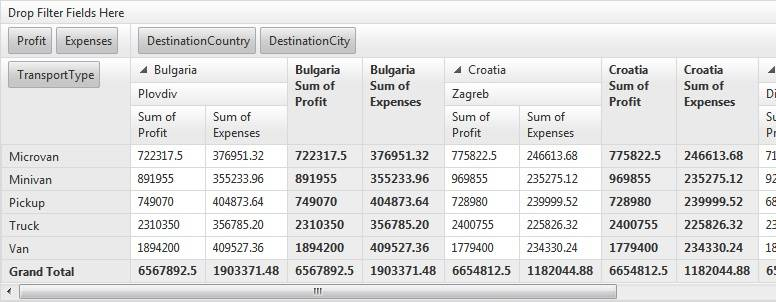

# Getting Started

RadPivotGrid is a data summarization control where users can break down raw data in any manner they want. A pivot table can help quickly summarize the reports and highlight the desired information. It displays data in format such as spreadsheets or business intelligence applications. That is why it is good for showing reports in interactive web pages where the users can easily see the data they need.

## Creating and Binding the RadPivotGrid

1.Locate the database file which will be used for binding the __PivotGrid__ in the __AppData__ folder of your application.

2. Use the PivotGrid SmartTag to select the needed DataSource:

3. Set up your DataSource with the required fields:

and test the generated query:

4. After having the data set you could use the __PivotGrid Collection Editor__ to set the __Pivot Fields__. Note that you should add a __DataField__ property for them:

5. The PivotGrid will summarize the data like this:
