# Aggregates Position

RadPivotGrid offers several options for setting its aggregate position depending on the row table layout. These options could be set my using the __RowTableLayout__, __AggregatesPosition__ and __AggregatesLevel__ properties of the control. The aggregate position could be set to __Rows__ or __Column__.

Below follow descriptions of the Aggregate positions based on the __RowTableLayout__ and the and __AggregatesLevel__.

## AggregatesPosition="Rows"

1. __RowTableLayout="Tabular"__

* Below is an example with aggreagtes on level three:#_ASPX_

	
                  <telerik:RadPivotGrid ID="RadPivotGrid1" runat="server" DataSourceID="SqlDataSource1" Skin="Metro" AggregatesPosition="Rows" RowTableLayout="Tabular" AggregatesLevel="3">
                

Here is the same layout with items on the first level collapsed: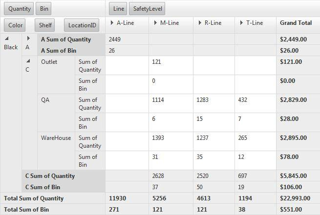

* Below is an example with aggreagtes on level two:#_ASPX_

	
                  <telerik:RadPivotGrid ID="RadPivotGrid1" runat="server" DataSourceID="SqlDataSource1" Skin="Metro" AggregatesPosition="Rows" RowTableLayout="Tabular" AggregatesLevel="2">
                

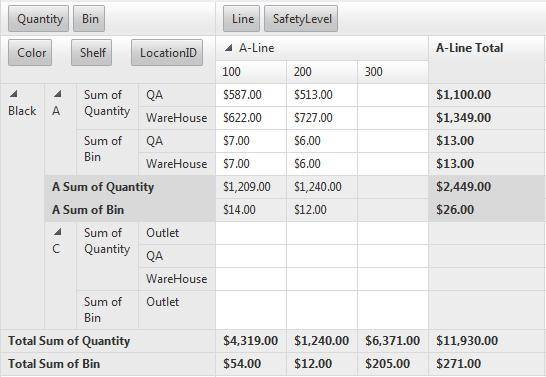Here is the same layout with some collapsed items: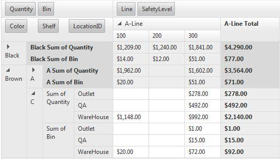

* Below is an example with aggreagtes on level one:#_ASPX_

	
                  <telerik:RadPivotGrid ID="RadPivotGrid1" runat="server" DataSourceID="SqlDataSource1" Skin="Metro" AggregatesPosition="Rows" RowTableLayout="Tabular" AggregatesLevel="1">
                

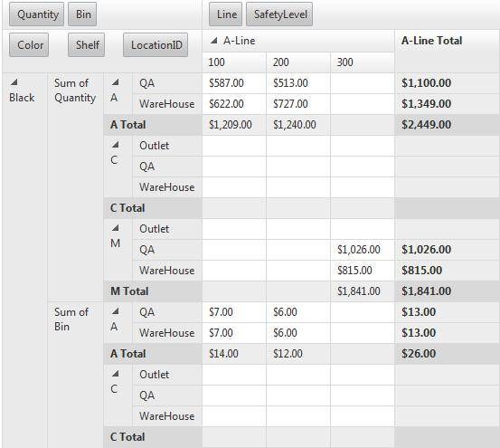Here is the same layout with some collapsed items:

* Below is an example with aggreagtes on level zero:#_ASPX_

	
                  <telerik:RadPivotGrid ID="RadPivotGrid1" runat="server" DataSourceID="SqlDataSource1" Skin="Metro" AggregatesPosition="Rows" RowTableLayout="Tabular" AggregatesLevel="0">
                

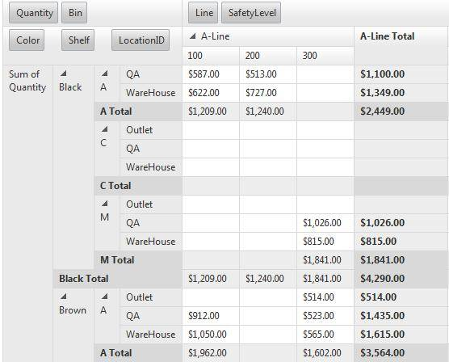Here is the same layout with some collapsed items:

1. __RowTableLayout="Outline"__

* Below is an example with aggreagtes on level three:#_ASPX_

	
                  <telerik:RadPivotGrid ID="RadPivotGrid1" runat="server" DataSourceID="SqlDataSource1" Skin="Metro" AggregatesPosition="Rows" RowTableLayout="Outline" AggregatesLevel="3">
                

Here is the same layout with some collapsed items: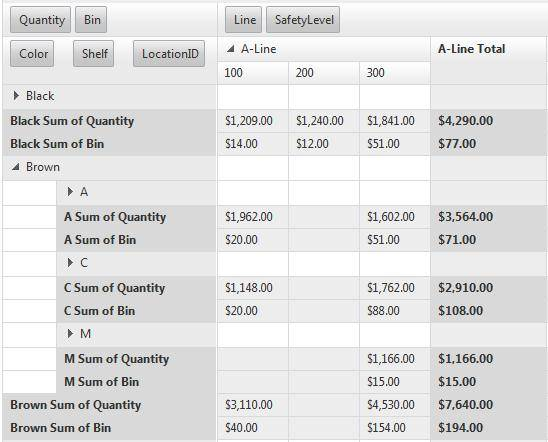

* Below is an example with aggreagtes on level two:#_ASPX_

	
                  <telerik:RadPivotGrid ID="RadPivotGrid1" runat="server" DataSourceID="SqlDataSource1" Skin="Metro" AggregatesPosition="Rows" RowTableLayout="Outline" AggregatesLevel="2">
                

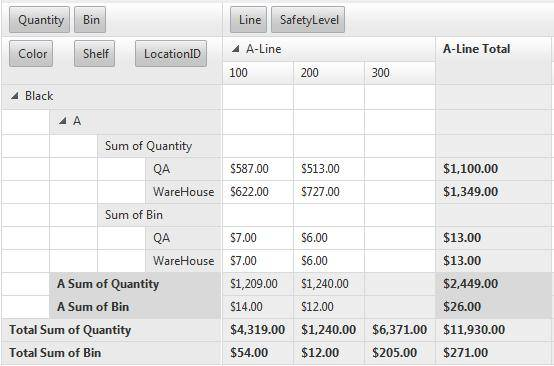

* Below is an example with aggreagtes on level one with collapsed items:#_ASPX_

	
                  <telerik:RadPivotGrid ID="RadPivotGrid1" runat="server" DataSourceID="SqlDataSource1" Skin="Metro" AggregatesPosition="Rows" RowTableLayout="Outline" AggregatesLevel="1">
                

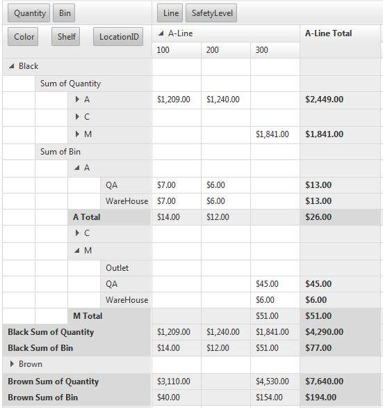

* Below is an example with aggreagtes on level zero with collapsed items:#_ASPX_

	
                  <telerik:RadPivotGrid ID="RadPivotGrid1" runat="server" DataSourceID="SqlDataSource1" Skin="Metro" AggregatesPosition="Rows" RowTableLayout="Outline" AggregatesLevel="0">
                

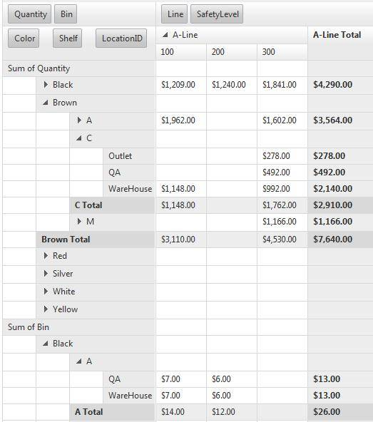

1. __RowTableLayout="Compact"__

* Below is an example with aggreagtes on level three:#_ASPX_

	
                  <telerik:RadPivotGrid ID="RadPivotGrid1" runat="server" DataSourceID="SqlDataSource1" Skin="Metro" AggregatesPosition="Rows" RowTableLayout="Compact" AggregatesLevel="3">
                

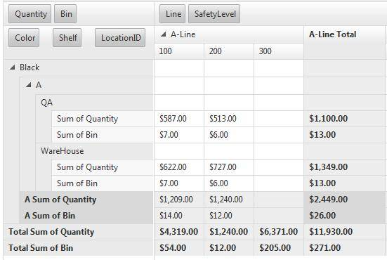Here is the same layout with items on the first level collapsed: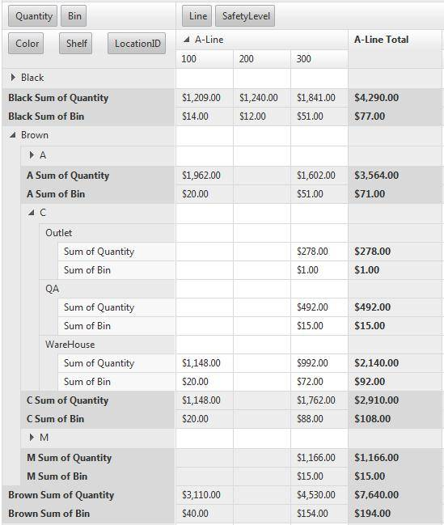

* Below is an example with aggreagtes on level two:#_ASPX_

	
                  <telerik:RadPivotGrid ID="RadPivotGrid1" runat="server" DataSourceID="SqlDataSource1" Skin="Metro" AggregatesPosition="Rows" RowTableLayout="Compact" AggregatesLevel="2">
                

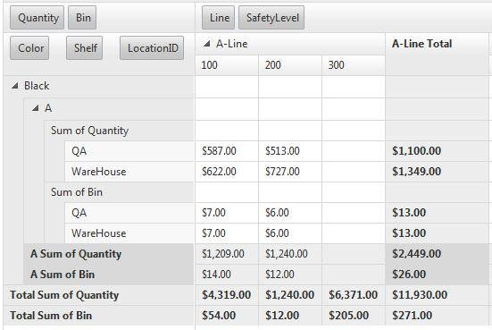

* Below is an example with aggreagtes on level one with some collapsed items:#_ASPX_

	
                  <telerik:RadPivotGrid ID="RadPivotGrid1" runat="server" DataSourceID="SqlDataSource1" Skin="Metro" AggregatesPosition="Rows" RowTableLayout="Compact" AggregatesLevel="1">
                

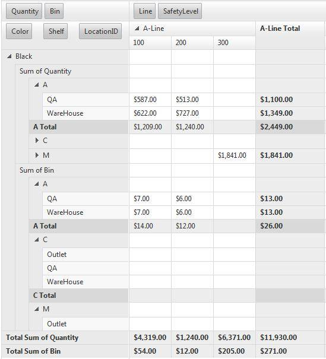

* Below is an example with aggreagtes on level zero with some collapsed items:#_ASPX_

	
                  <telerik:RadPivotGrid ID="RadPivotGrid1" runat="server" DataSourceID="SqlDataSource1" Skin="Metro" AggregatesPosition="Rows" RowTableLayout="Compact" AggregatesLevel="0">
                

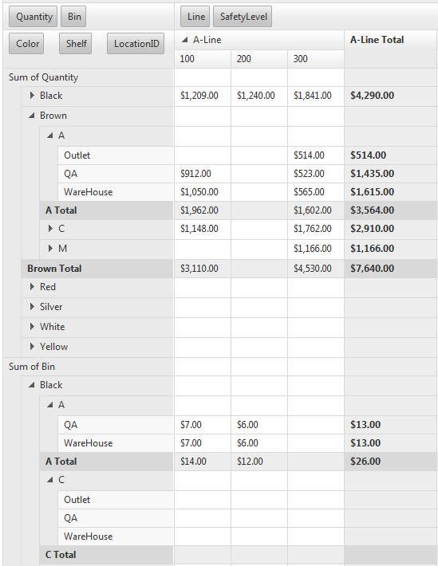

## AggregatesPosition="Columns"

1. __RowTableLayout="Tabular"__

* Below is an example with aggreagtes on level two:#_ASPX_

	
                  <telerik:RadPivotGrid ID="RadPivotGrid1" runat="server" DataSourceID="SqlDataSource1" Skin="Metro" AggregatesPosition="Columns" RowTableLayout="Tabular" AggregatesLevel="2">
                

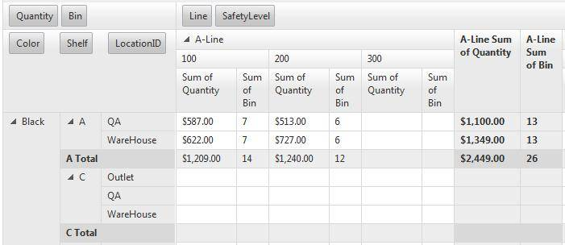

* Below is an example with aggreagtes on level one:#_ASPX_

	
                  <telerik:RadPivotGrid ID="RadPivotGrid1" runat="server" DataSourceID="SqlDataSource1" Skin="Metro" AggregatesPosition="Columns" RowTableLayout="Tabular" AggregatesLevel="1">
                

Here is the same layout with some collapsed items: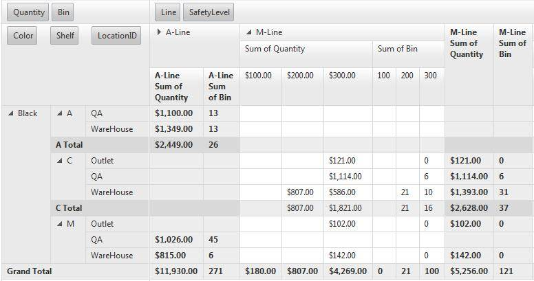

* Below is an example with aggreagtes on level zero:#_ASPX_

	
                  <telerik:RadPivotGrid ID="RadPivotGrid1" runat="server" DataSourceID="SqlDataSource1" Skin="Metro" AggregatesPosition="Rows" RowTableLayout="Tabular" AggregatesLevel="0">
                

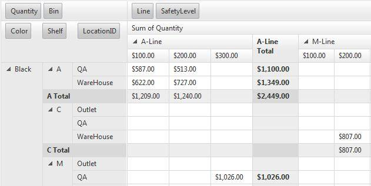

1. __RowTableLayout="Outline"__

* Below is an example with aggreagtes on level two:#_ASPX_

	
                  <telerik:RadPivotGrid ID="RadPivotGrid1" runat="server" DataSourceID="SqlDataSource1" Skin="Metro" AggregatesPosition="Columns" RowTableLayout="Outline" AggregatesLevel="2">
                

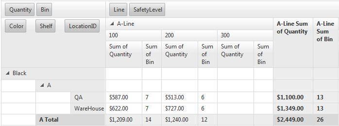

* Below is an example with aggreagtes on level one :#_ASPX_

	
                  <telerik:RadPivotGrid ID="RadPivotGrid1" runat="server" DataSourceID="SqlDataSource1" Skin="Metro" AggregatesPosition="Columns" RowTableLayout="Outline" AggregatesLevel="1">
                

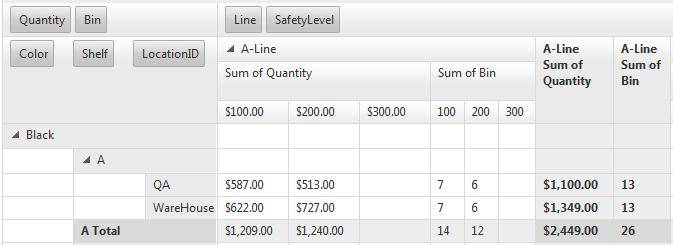

* Below is an example with aggreagtes on level zero:#_ASPX_

	
                  <telerik:RadPivotGrid ID="RadPivotGrid1" runat="server" DataSourceID="SqlDataSource1" Skin="Metro" AggregatesPosition="Columns" RowTableLayout="Outline" AggregatesLevel="0">
                

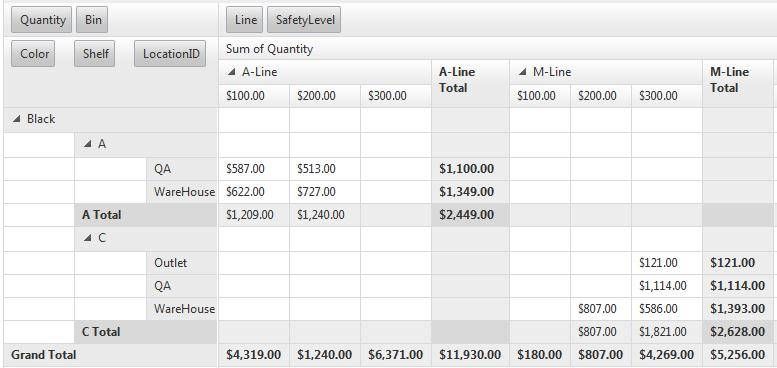

1. __RowTableLayout="Compact"__

* Below is an example with aggregates on level two:#_ASPX_

	
                  <telerik:RadPivotGrid ID="RadPivotGrid1" runat="server" DataSourceID="SqlDataSource1" Skin="Metro" AggregatesPosition="Columns" RowTableLayout="Compact" AggregatesLevel="2">
                

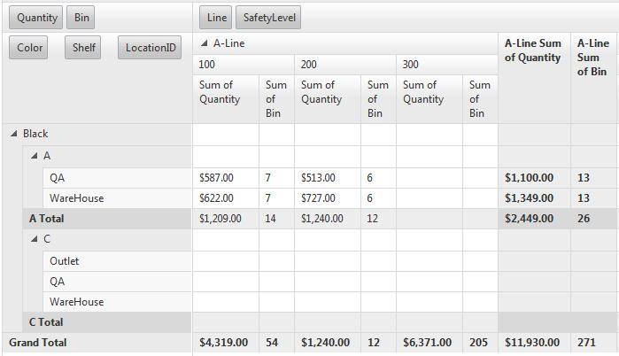Here is the same layout with three column fields and some collapsed items: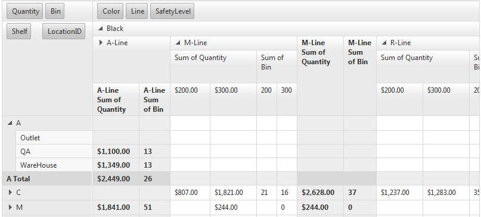

* Below is an example with aggreagtes on level one with three column fields and some collapsed items:#_ASPX_

	
                  <telerik:RadPivotGrid ID="RadPivotGrid1" runat="server" DataSourceID="SqlDataSource1" Skin="Metro" AggregatesPosition="Columns" RowTableLayout="Compact" AggregatesLevel="1">
                

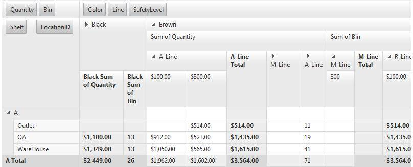

* Below is an example with aggreagtes on level zero with three column fields and some collapsed items:#_ASPX_

	
                  <telerik:RadPivotGrid ID="RadPivotGrid1" runat="server" DataSourceID="SqlDataSource1" Skin="Metro" AggregatesPosition="Columns" RowTableLayout="Compact" AggregatesLevel="0">
                

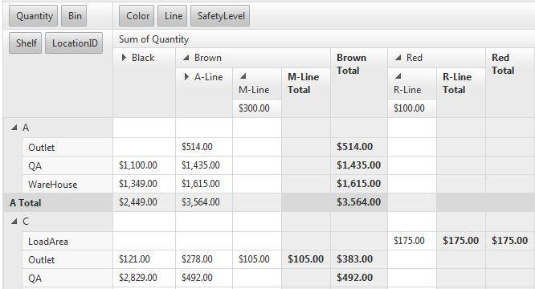
