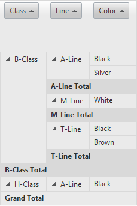
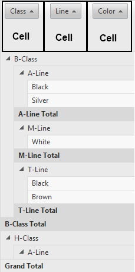

# Layouts Overview

RadPivotGrid offers three options for setting its row table layout, so that it better fits the requirements for displaying data	of a given scenario. To choose which layout your pivot grid should use, set the __RowTableLayout__ property	of the control to one of the listed values:	__Compact__, __Outline__ or __Tabular__.#_ASPX_

	
				<telerik:RadPivotGrid ID="RadPivotGrid1" runat="server" DataSourceID="SqlDataSource1" Skin="Metro" RowTableLayout="Compact">
			

Below follow descriptions of thelayouts and their main usage.

## Compact

Use this layout to keep related data from spreading horizontally off the screen and to help minimize scrolling.Beginning fields on the side are contained in one column and are indented to show the nested column relationship:

## Outline

Use to outline the data in the classic PivotTable style:

## Tabular

Use to see all data in a traditional table format and to easily copy cells to another worksheet. *Tabular is the default value of the RowTableLayout property.*

## Layout specifics

When the __Compact layout__ is used and the vertical scroll is disabled the *	RowHeaderZone	contains only one cell* with rendered PivotGridFieldRenderingControlsinto it:

In this case the __RadPivotgrid.GetRowZones()__ method will return collection which contains onlyone PivotGridRowZone item.

When the other two layouts are chosen or the vertical scroll is enabled the *RowHeaderZone contains one or more cells corresponding to the PivotGridRowFields count*. *For example:* If the RadPivotGrid control contains three PivotGridRowField the RowHeaderZone will have three cells.

In this case the __RadPivotgrid.GetRowZones()__ method will return collection which contains threePivotGridRowZone items.
