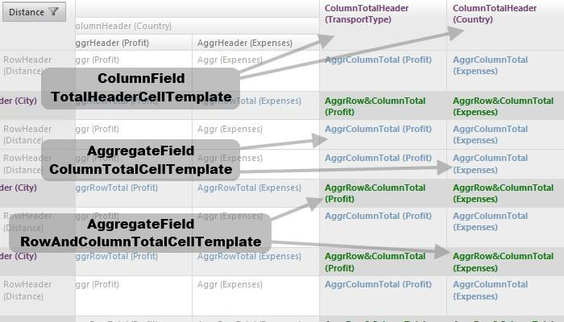

# Templates


**RadPivotGrid** templates are instantiated within the row header, column header and data cells.Due to the nature of the control, the usual **Eval / DataBinder.Eval** approach for extracting the value won’t work. Instead, one could use the **Container.DataItem** property to get hold of the underlying cell value.

````C#
<telerik:PivotGridAggregateField DataField="Expenses">
     <celltemplate>
		<asp:Label ID="Label1" runat="server" Style="color: #aaa">
		 <%# Container.DataItem %>
		</asp:Label>
	 </celltemplate>
</telerik:PivotGridAggregateField>
````


## ColumnField templates

* **CellTemplate**-this template is instantiated in the column header cells.

* **TotalHeaderCellTemplate**-instantiated in the column total cells.

## RowField templates

* **CellTemplate**-this template is instantiated in the row header cells.

* **TotalHeaderCellTemplate**-instantiated in the row total cells.

## AggregateField templates

* **CellTemplate**- this template will be instantiated in the data cells.

* **HeaderCellTemplate**- depending on the current aggregate position this template.

* **RowTotalCellTemplate**- will be instantiated in the data cells which belong to the row totals.

* **ColumnTotalCellTemplate**- will be instantiated in the data cells which belong to the column totals.

* **RowAndColumnTotalCellTemplate**- this template will be instantiated in the cell where the row and column totals intersect.

* **RowGrandTotalCellTemplate**– instantiated in the data cells which belong to the grand total row.

* **ColumnGrandTotalCellTemplate**– instantiated in the data cells which belong to the grand total column.

* **RowAndColumnGrandTotalCellTemplate**– this template will be instantiated in the cell where the row and column grand totals intersect.

* **RowGrandTotalHeaderCellTemplate**– instantiated in the header of the grand total row.

* **ColumnGrandTotalHeaderCellTemplate**– instantiated in the header of the grand total column .

## Sample representations.

The images below presents the different templates instantiation:

* **CoulmnField CellTemplate, RowField CellTemplate and RowField TotalHeaderCellTemplate** are presented in the screenshot bellow:


* **RowTotalCellTemplate,CellTemplate and HeaderCellTemplate for the AggregateField** are demonstrated in the screenshot bellow:


* **CoulmnField TotalHeaderCellTemplate, AggregateField ColumnTotalCellTemplate and AggregateField RowAndColumnTotalCellTemplate** are presented in the screenshot bellow:


* **ColumnGrandTotalCellTemplate ,RowAndColumnGrandTotalCellTemplate and RowGrandTotalCellTemplatefor the AggregateField** are demonstrated in the screenshot bellow:

