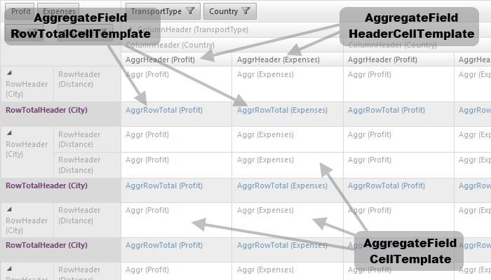
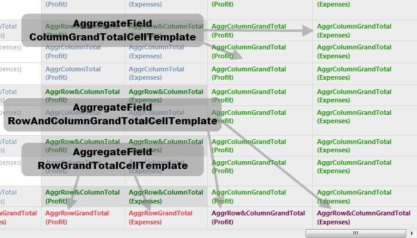

# Templates


__RadPivotGrid__ templates are instantiated within the row header, column header and data cells.Due to the nature of the control, the usual __Eval / DataBinder.Eval__ approach for extracting the value won’t work. Instead, one could use the __Container.DataItem__ property to get hold of the underlying cell value.

````C#
	    <telerik:PivotGridAggregateField DataField="Expenses">
	        <celltemplate>
	      <asp:Label ID="Label1" runat="server" Style="color: #aaa">
	         <%# Container.DataItem %>
	      </asp:Label>
	   </celltemplate>
	    </telerik:PivotGridAggregateField>
````


## ColumnField templates

* __CellTemplate__-this template is instantiated in the column header cells.

* __TotalHeaderCellTemplate__-instantiated in the column total cells.

## RowField templates

* __CellTemplate__-this template is instantiated in the row header cells.

* __TotalHeaderCellTemplate__-instantiated in the row total cells.

## AggregateField templates

* __CellTemplate__- this template will be instantiated in the data cells.

* __HeaderCellTemplate__- depending on the current aggregate position this template.

* __RowTotalCellTemplate__- will be instantiated in the data cells which belong to the row totals.

* __ColumnTotalCellTemplate__- will be instantiated in the data cells which belong to the column totals.

* __RowAndColumnTotalCellTemplate__- this template will be instantiated in the cell where the row and column totals intersect.

* __RowGrandTotalCellTemplate__– instantiated in the data cells which belong to the grand total row.

* __ColumnGrandTotalCellTemplate__– instantiated in the data cells which belong to the grand total column.

* __RowAndColumnGrandTotalCellTemplate__– this template will be instantiated in the cell where the row and column grand totals intersect.

* __RowGrandTotalHeaderCellTemplate__– instantiated in the header of the grand total row.

* __ColumnGrandTotalHeaderCellTemplate__– instantiated in the header of the grand total column .

## Sample representations.

The images below presents the different tempaltes instantioation:

* __CoulmnField CellTemplate, RowField CellTemplate and RowField TotalHeaderCellTemplate__ are presented in the screenshot bellow:

* __RowTotalCellTemplate,CellTemplate and HeaderCellTemplate for the AggregateField__ are demonstrated in the screenshot bellow:

* __CoulmnField TotalHeaderCellTemplate, AggregateField ColumnTotalCellTemplate and AggregateField RowAndColumnTotalCellTemplate__ are presented in the screenshot bellow:

* __ColumnGrandTotalCellTemplate ,RowAndColumnGrandTotalCellTemplate and RowGrandTotalCellTemplatefor the AggregateField__ are demonstrated in the screenshot bellow:
